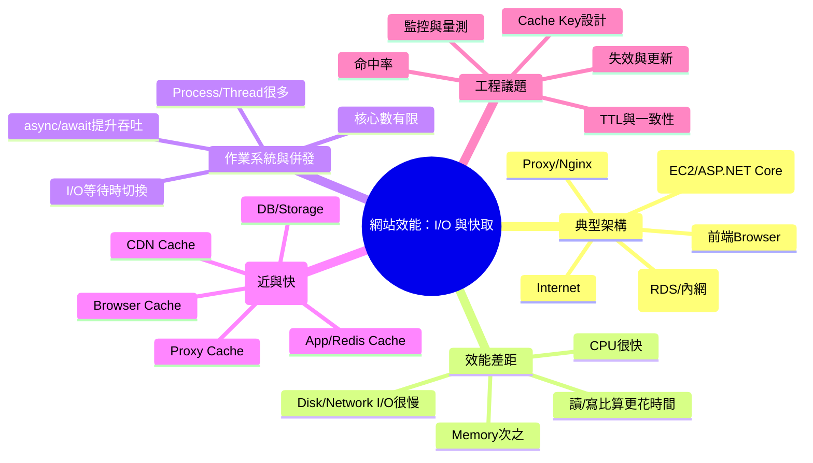

# 📌 本節主題總覽（3~5句摘要）

這段課程用「典型網站架構」帶出效能的本質：多數系統變慢不是 CPU 不夠快，而是卡在 **I/O（網路、磁碟、資料庫）等待**。講者用「把 CPU 一個 cycle 當成 1 秒」的縮放比喻，讓初學者直覺理解：**計算很快、搬資料很慢**。因此，工程上常見的解法不是一直加 CPU，而是用 **快取（Cache）把資料放到更近、更快的位置**。快取可出現在多層：瀏覽器、CDN、Proxy（Nginx）、應用程式記憶體/Redis、以及資料庫本身的緩衝。

# 🧠 核心觀念拆解

## 1. 典型網站架構（Front-end → Internet → Proxy → App → DB）

- 定義：使用者透過瀏覽器（前端）發出 HTTP 請求，經由 Internet 到達反向代理/負載平衡（如 Nginx），再到後端 Web Server（如 AWS EC2 上的 ASP.NET Core），最後存取資料庫（正式環境常是獨立 DB 服務如 RDS，通常在內網）。
- 為什麼重要（Why）：你要優化效能、查問題、做擴充，必須先能畫出請求路徑，才能定位瓶頸在「哪一段」。
- 運作原理（How）：
    1. Browser 發 request
    2. Internet 傳輸
    3. Proxy 轉發/快取/SSL 終止
    4. App 執行商業邏輯
    5. DB 查詢/寫入（走內網較快較穩）
- 範例（ASP.NET Core MVC 情境）：成衣廠「工單查詢」頁面：瀏覽器呼叫 `/WorkOrders/Detail/WO123` → Controller → Service → DB 查工單、明細、工序、用料。
- 常見錯誤：
    - 把「網站慢」直覺怪罪 CPU，但其實是 DB/網路慢。
    - 把 DB 跟 App 混放同台當成常態（小系統可，正式環境多會拆開）。

## 2. 效能的真相：CPU 很快，I/O 很慢（Latency 差距）

- 定義：CPU 計算速度遠快於從記憶體、磁碟、網路取回資料的速度；系統時間常花在等待 I/O。
- 為什麼重要（Why）：你會學到「優化優先順序」：先減少遠端呼叫與磁碟/DB 存取，再談微優化程式碼。
- 運作原理（How）：
    - 程式執行常是：**讀資料 → 計算 → 寫回**
    - 其中「讀/寫」若落在磁碟或跨網路（含 DB），延遲會比 CPU 計算大很多個數量級。
- 範例（ASP.NET Core MVC + DB）：
    - 一個頁面如果做 20 次 SQL 查詢（尤其跨網路到 RDS），通常比你在 C# 裡迴圈算 1 萬次還慢。
- 常見錯誤：
    - 只看 CPU 使用率低就以為系統很閒；其實可能整體卡在 I/O 等待。
    - 把「多查幾次 DB 沒差」當成習慣（N+1 Query）。

## 3. 為什麼 Process/Thread 數量能超過 CPU 核心？（因為在等 I/O）

- 定義：同一時間系統上執行的工作（process/thread）常多於 CPU 核心數，作業系統用排程讓它們輪流使用 CPU。
- 為什麼重要（Why）：理解「非同步、併發」的價值：當某些工作在等 DB/網路時，不應阻塞整個伺服器吞吐量。
- 運作原理（How）：
    - 工作遇到慢 I/O（讀檔、等 DB、等 HTTP）時，CPU 可切換去執行其他工作，提高整體利用率。
- 範例（ASP.NET Core MVC）：
    - Controller 用 `async/await` 等待資料庫查詢時，Thread 可以回到 ThreadPool 服務其他請求（提升吞吐）。
- 常見錯誤：
    - 把所有事情都做成同步阻塞（`.Result`、`.Wait()`），導致 ThreadPool 壅塞、吞吐下降。

## 4. 快取（Cache）：把資料放到更近、更快的地方

- 定義：將常用或可重用的結果暫存於較快/較近的儲存層，避免重複的遠端 I/O（尤其 DB/跨網路）。
- 為什麼重要（Why）：在不改變硬體物理限制（網路距離、磁碟延遲）的前提下，快取是最常見且有效的加速手段。
- 運作原理（How）：常見分層（由近到遠）
    1. **Browser Cache**（使用者端）
    2. **CDN Cache**（就近節點快取靜態資源）
    3. **Proxy Cache**（Nginx/反向代理層快取）
    4. **App/Redis Cache**（應用層記憶體/分散式快取）
    5. **DB/Storage**（最終真實來源）
- 範例（C#, ASP.NET Core MVC：用 MemoryCache 快取工單資料）

```csharp
using Microsoft.Extensions.Caching.Memory;

public class WorkOrderService
{
    private readonly IMemoryCache _cache;
    private readonly WorkOrderRepository _repo;

    public WorkOrderService(IMemoryCache cache, WorkOrderRepository repo)
    {
        _cache = cache;
        _repo = repo;
    }

    public async Task<WorkOrderDto> GetWorkOrderAsync(string woNo)
    {
        var cacheKey = $"workorder:{woNo}";

        if (_cache.TryGetValue(cacheKey, out WorkOrderDto dto))
            return dto;

        dto = await _repo.GetWorkOrderDtoAsync(woNo);

        _cache.Set(cacheKey, dto, new MemoryCacheEntryOptions
        {
            AbsoluteExpirationRelativeToNow = TimeSpan.FromSeconds(30)
        });

        return dto;
    }
}
```

- 常見錯誤：
    - 沒設計過期策略（TTL）與更新策略（資料變更後快取不一致）。
    - 快取 Key 沒包含必要維度（例如廠別、權限、語系），導致資料串用或洩漏。
    - 把「所有資料都快取」：造成記憶體爆掉、或一致性成本過高。


## 5. CDN 的直覺：把靜態資源與內容「撒到全世界」

- 定義：CDN（Content Delivery Network）在全球佈建節點，讓使用者就近取得快取內容（HTML/CSS/JS/圖片/影片等）。
- 為什麼重要（Why）：跨國/跨海網路延遲是物理限制；CDN 透過就近服務大幅降低延遲與原站壓力。
- 運作原理（How）：
    - 命中（hit）：直接從最近節點回應
    - 未命中（miss）：節點回源（到原站拿），再快取起來
- 範例（ASP.NET Core MVC 靜態檔案配合快取標頭）：對 `wwwroot` 設定長快取，搭配檔名指紋（hash）避免舊檔問題。
- 常見錯誤：
    - 未做版本化（檔名不變），導致使用者端/節點端拿到舊 JS/CSS。
    - 忽略快取清除/失效機制（purge / invalidation）。

# 🗺 知識結構圖（Mermaid mindmap）



# 🏗 抽象層級分析

- 這個觀念屬於哪個 abstraction layer？
    - 橫跨多層：**系統架構層（Web 架構）**、**作業系統層（排程/I-O）**、**應用層（快取策略、非同步）**、**基礎設施層（CDN/Proxy/DB 佈署）**。
- 它解決的是哪一種 engineering problem？
    - **效能/延遲（latency）**、**吞吐量（throughput）**、**成本（少打 DB / 少跨網路）**、**可擴充性（scalability）**。
- 有沒有替代方案？
    - 垂直擴充（升級機器/更快 SSD）、水平擴充（更多 App 節點）、資料庫優化（索引/查詢重寫）、讀寫分離、CQRS/預先計算、事件驅動等。
- 它的 trade-off 是什麼？
    - **速度 vs 一致性**、**成本 vs 複雜度**、**命中率提升 vs 失效策略困難**、**快取越近越快但越容易舊**。

# ⚠ 設計上的陷阱與邊界條件

- **一致性陷阱**：工單狀態剛更新（已裁剪/已縫製）但快取仍是舊狀態，導致產線誤判。
- **快取污染**：Cache Key 沒含「廠別/客戶/權限」，A 廠看到 B 廠資料（資安重大事故）。
- **熱點 Key**：同一工單/同一款式被大量查詢，單點快取或單 Redis 節點被打爆。
- **快取穿透/擊穿/雪崩**：不存在資料反覆查 DB、同時過期瞬間大量回源。
- **部署更新問題**：靜態檔案未版本化，使用者端快取舊 JS，造成「前後端版本不一致」錯誤。

# 📘 可加入知識庫的標準定義版本

## 1) Beginner 必須理解

- **網站請求會經過多段路徑**（Browser → Internet → Proxy → App → DB），任何一段慢都會讓整體慢。
- **CPU 計算通常不是瓶頸**；瓶頸多在 **I/O（網路、磁碟、資料庫）**。
- **快取的目的**：避免重複且昂貴的 I/O，把資料放在更近、更快的地方。

## 2) Intermediate 必須掌握

- 快取分層與適用資料：Browser/CDN 適合靜態資源；Redis/App cache 適合熱資料與查詢結果。
- 必須會設計：**Cache Key、TTL、失效策略（資料更新如何同步）**。
- 必須能用量測做決策：DB query 次數、P95 latency、cache hit rate。

## 3) Advanced 才需要深入

- 快取一致性策略：write-through、write-behind、cache-aside、雙寫一致性風險。
- 併發與故障模式：熱點、雪崩、分散式鎖、SingleFlight、降級/熔斷。
- 全鏈路效能治理：CDN/Proxy/DB/應用的指標、追蹤（tracing）、容量規劃。

**層級差異說明**：  
Beginner 重在「知道為什麼慢、快取是什麼」；Intermediate 重在「能正確用快取且不出事」；Advanced 重在「在大流量與故障情境下仍穩定、可觀測、可擴充」。

# 🔗 與其他技術的關聯

- 與資料結構的關聯：
    - 快取常用 HashMap/Dictionary（Key→Value），牽涉 LRU/LFU 等淘汰策略。
- 與作業系統的關聯：
    - I/O 等待、排程、context switch；非同步 I/O 與 thread pool 行為直接影響吞吐。
- 與設計模式的關聯：
    - Cache-Aside（旁路快取）、Decorator（在服務外包一層快取）、Proxy（反向代理快取）。
- 與實務開發的關聯：
    - API 慢 → 先看 DB 次數與網路往返；前端舊檔 → 靜態資源版本化與快取標頭。

# 🚀 實務應用場景

以成衣製造公司為例：

- **工單看板（產線主管）**每 5 秒刷新一次「今日待做工序數、瓶頸站點、異常工單」。如果每次都打 DB 且查多張表，DB 與網路延遲會快速累積。
- 解法會是「分層快取」：
    1. 工單看板 API 回傳可快取 5~15 秒的聚合結果（App/Redis cache）
    2. 圖示、JS、CSS 走 CDN（長快取 + 檔名 hash）
    3. Proxy/Nginx 對某些 GET API 做短快取（視一致性需求）
    4. DB 專注處理寫入與必要查詢，減少被讀流量拖垮