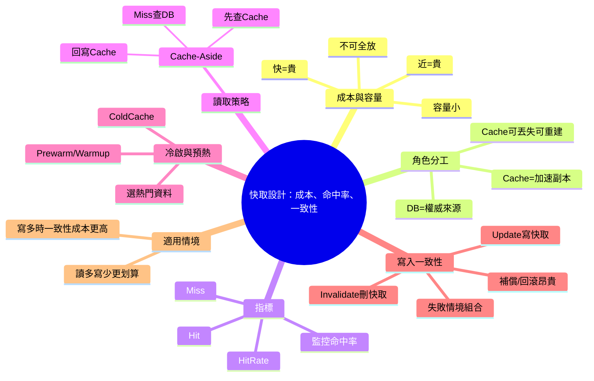

# 📌 本節主題總覽（3~5句摘要）

本節延續「快取讓系統更快」的概念，但強調一個現實：**越快、越近通常越貴、容量越小**，而且快取不等於資料庫。當資料同時存在「原始資料庫」與「快取」兩處時，會產生核心工程問題：**一致性（資料怎麼同步、何時失效）**。課程接著介紹快取的基本名詞（Hit/Miss/Hit Rate）與最常見的讀取策略（Cache-Aside）。最後討論寫入/更新時的兩種策略：**更新時刪快取（Invalidate）** vs **同步更新快取（Write-through 類型）**，並提醒複雜一致性會帶來更多失敗情境與回滾成本。

# 🧠 核心觀念拆解

## 1. 「快、近」的代價：快取很貴且容量小

- 定義：越靠近 CPU/使用者、延遲越低的儲存層（CPU Cache、RAM、Redis、CDN 邊緣節點）通常**成本更高、可用容量更小**。
- 為什麼重要（Why）：你不可能把「所有資料」都放進快取；必須挑選「值得快取」的資料，並接受快取只是加速層。
- 運作原理（How）：
    - 硬體：L1/L2/L3 cache、RAM 的單位成本遠高於磁碟。
    - 基礎設施：CDN/邊緣節點鋪設與流量費用昂貴；越多地區佈點越貴。
- 範例（成衣廠系統直覺）：
    - 「今日產線看板」是高頻讀取，適合快取。
    - 「歷史十年前工單」很少查，放快取浪費錢。
- 常見錯誤：
    - 把快取當資料庫用（把唯一資料放 Redis/Memory，導致重啟或淘汰後資料遺失）。
    - 沒有成本觀念，看到慢就「全部上快取」但命中率很低。

## 2. 快取 ≠ 資料庫：原始資料必須有權威來源（Source of Truth）

- 定義：資料庫是長期保存、具一致性與查詢能力的「權威資料來源」；快取是可丟失、可重建的「加速副本」。
- 為什麼重要（Why）：快取可能過期、淘汰、服務故障；若把快取當唯一來源會造成不可逆資料損失。
- 運作原理（How）：
    - DB 保存「真實資料」；Cache 保存「可由 DB 重算/重抓的結果」。
- 範例（ASP.NET Core MVC）：
    - 訂單（工單）狀態的權威來源在 DB。
    - 快取存「工單詳情 DTO」或「查詢結果」以減少 DB 次數。
- 常見錯誤：
    - 把交易型資料（例如扣庫存）只寫快取不寫 DB。
    - 快取資料缺少版本/時間戳，查到舊資料無法判斷。

## 3. 快取基本名詞：Hit / Miss / Hit Rate

- 定義：
    - **Hit（命中）**：要的資料在快取裡找得到。
    - **Miss（未命中）**：快取裡沒有，需要回源（通常到 DB）。
    - **Hit Rate（命中率）**：Hit / (Hit + Miss)，越高代表快取越有效。
- 為什麼重要（Why）：你花錢做快取，最終 KPI 往往就是「命中率與延遲是否下降」。
- 運作原理（How）：
    - 命中率受「快取容量、Key 設計、TTL、預熱、資料熱度分佈」影響。
- 範例：
    - 10 次查詢有 8 次命中 → Hit Rate = 80%。
- 常見錯誤：
    - 只做快取但不監控命中率，最後不知道到底有沒有變快。
    - Key 設計錯誤導致「明明有快取卻命不中」（例如漏掉廠別/語系/權限）。

## 4. 讀取策略：Cache-Aside（旁路快取，最常見）

- 定義：讀取時先查快取；Miss 才查資料庫，並把結果寫回快取，讓下一次更容易 Hit。
- 為什麼重要（Why）：實務上最容易落地、最少侵入既有資料庫設計，Redis 也最常搭配這種方式。
- 運作原理（How）：
    1. Read Cache
    2. Miss → Read DB
    3. Write Cache
    4. Return response
- 範例（C#, ASP.NET Core MVC + IDistributedCache）：

```csharp
using System.Text.Json;
using Microsoft.Extensions.Caching.Distributed;

public class WorkOrderService
{
    private readonly IDistributedCache _cache;
    private readonly WorkOrderRepository _repo;

    public WorkOrderService(IDistributedCache cache, WorkOrderRepository repo)
    {
        _cache = cache;
        _repo = repo;
    }

    public async Task<WorkOrderDto?> GetAsync(string woNo)
    {
        var key = $"workorder:{woNo}";
        var cached = await _cache.GetStringAsync(key);

        if (!string.IsNullOrEmpty(cached))
            return JsonSerializer.Deserialize<WorkOrderDto>(cached);

        var dto = await _repo.GetWorkOrderDtoAsync(woNo);
        if (dto == null) return null;

        await _cache.SetStringAsync(
            key,
            JsonSerializer.Serialize(dto),
            new DistributedCacheEntryOptions
            {
                AbsoluteExpirationRelativeToNow = TimeSpan.FromMinutes(1)
            });

        return dto;
    }
}
```

- 常見錯誤：
    - Miss 後不回寫快取，導致每個人都回源，命中率永遠上不去。
    - TTL 太長導致資料太舊；TTL 太短導致一直 Miss。

## 5. 「第一個使用者很倒楣」與預熱（Cache Prewarm/Warmup）

- 定義：
    - **冷啟（Cold Cache）**：快取剛建立或剛失效，第一個請求必定 Miss。
    - **預熱（Prewarm/Warmup）**：在資料上架/批次作業時，先把熱門資料寫入快取，降低冷啟 Miss。
- 為什麼重要（Why）：在尖峰流量或新內容上線時，冷啟可能造成大量回源，把 DB 打爆。
- 運作原理（How）：
    - 後台上架（Insert/Publish）→ 同步或非同步把熱門 Key 填入快取。
- 範例（成衣廠）：
    - 每天早班前先把「今日工單清單、線別看板指標」預熱進 Redis。
- 常見錯誤：
    - 預熱全部資料：成本高且不必要。
    - 預熱沒有選熱點資料，命中率提升不明顯。

## 6. 寫入/更新策略：Invalidate（刪快取） vs Update（寫快取）

- 定義：
    - **Invalidate（失效/刪除快取）**：後台更新 DB 後，把相關快取 Key 刪掉；下次讀取自然回源重建。
    - **Update（同步更新快取）**：後台更新 DB 同時也更新快取內容。
- 為什麼重要（Why）：資料一旦分散在兩處，就必須選擇一致性策略；不同策略對「正確性、複雜度、延遲」影響很大。
- 運作原理（How）：
    - Invalidate：寫入路徑簡單，但下一個讀取者可能遇到 Miss（「下一個人倒楣」）。
    - Update：讀取更穩定、命中率更高，但寫入需要處理「兩邊成功/失敗」的組合問題。
- 範例（ASP.NET Core MVC：後台更新後刪快取）

```csharp
public class WorkOrderAdminService
{
    private readonly IDistributedCache _cache;
    private readonly WorkOrderRepository _repo;

    public WorkOrderAdminService(IDistributedCache cache, WorkOrderRepository repo)
    {
        _cache = cache;
        _repo = repo;
    }

    public async Task UpdateWorkOrderAsync(string woNo, UpdateWorkOrderCommand cmd)
    {
        await _repo.UpdateAsync(woNo, cmd);

        // 簡單可靠：讓下一次讀取自然回源重建
        await _cache.RemoveAsync($"workorder:{woNo}");
    }
}
```

- 常見錯誤：
    - 只更新 DB 沒失效快取 → 使用者一直看到舊資料。
    - 同步更新快取但沒處理失敗：DB 成功/快取失敗或反之，導致不一致。

## 7. 複雜一致性與回滾（Rollback）為何昂貴

- 定義：當你要求「DB 與 Cache 必須同時成功」時，會出現更多失敗情境，可能需要補償（compensation）或回滾。
- 為什麼重要（Why）：工程上「正向流程（下單、出貨）」通常比「逆向流程（退貨、撤銷、回滾）」簡單；一致性越嚴格，逆向處理越痛。
- 運作原理（How）：
    - 可能情境：
        - DB 成功、Cache 失敗
        - Cache 成功、DB 失敗
    - 你要決定：重試？刪除？以 DB 為準重建？是否需要交易（transaction）？
- 範例（成衣廠）：
    - 後台改了「工單數量」但快取還是舊值，導致備料/裁剪排程錯誤。
- 常見錯誤：
    - 企圖用「分散式交易」一次解完所有一致性，結果複雜度與故障面暴增。

# 🗺 知識結構圖（Mermaid mindmap）



# 🏗 抽象層級分析

- 這個觀念屬於哪個 abstraction layer？
    - **應用架構層**（Cache 策略）、**資料層**（DB 為權威）、**分散式系統層**（一致性與失敗處理）、以及部分 **硬體層**（CPU cache/memory 成本差）。
- 它解決的是哪一種 engineering problem？
    - **降低延遲、降低 DB 壓力、提升吞吐量**，並在可接受的範圍內管理 **一致性**。
- 有沒有替代方案？
    - 只做 DB 優化（索引、查詢重寫、讀寫分離）。
    - 以「預先計算/報表表」取代快取（例如 nightly batch 生成看板資料）。
    - 使用具備 cache 同步能力的整合方案（某些平台/框架），或採用事件驅動更新（DB 變更事件 → 刷新快取）。
- 它的 trade-off 是什麼？
    - **命中率/速度** vs **一致性/正確性**
    - **實作簡單（Invalidate）** vs **讀取更穩（Update/Prewarm）**
    - **成本** vs **效益**（快取越靠近越貴）

# ⚠ 設計上的陷阱與邊界條件

- **快取當資料庫**：Redis/MemCache 重啟或淘汰資料會不見，導致資料損毀。
- **一致性錯覺**：你以為更新時「順便寫快取」就萬無一失，但失敗一半很常見。
- **Key 粒度不對**：刪快取時刪不到正確 Key，舊資料一直存在。
- **熱點與雪崩**：大量 Key 同時過期 → 大量回源 → DB 壓垮。
- **讀多寫少假設不成立**：如果資料寫入很頻繁（例如即時報工），同步更新快取成本會飆升。

# 📘 可加入知識庫的標準定義版本

## Beginner 必須理解

- 快取（Cache）是「加速用的副本」，資料庫（DB）是「權威來源」。
- Hit/Miss/Hit Rate 是判斷快取是否有效的基本指標。
- 最常見策略是 Cache-Aside：先查快取，沒有再查 DB，並把結果寫回快取。

## Intermediate 必須掌握

- 為什麼「快、近」會更貴、容量更小 → 必須挑選資料快取。
- 更新資料時至少要會用 **Invalidate（刪快取）**，確保不會長期讀到舊資料。
- 能根據場景設定 TTL、設計 Cache Key、並監控命中率與延遲。

## Advanced 才需要深入

- 需要更高一致性時，會碰到「雙寫」失敗情境與補償策略（重試、以 DB 為準重建、事件刷新）。
- 預熱、避免雪崩/擊穿、熱點治理、降級策略。
- 在分散式架構下設計可觀測性（hit rate、miss reason、回源量）與容量規劃。

**差異說明**：  
Beginner 知道「快取是加速、DB 是真相」。Intermediate 能把快取安全地用在專案中（不讀舊、不亂串）。Advanced 能在高流量與高一致性需求下處理失敗、成本與可靠性。

# 🔗 與其他技術的關聯

- 與資料結構的關聯：
    - Key-Value 映射（Dictionary/HashMap）、淘汰策略（LRU/LFU）與資料熱度分佈。
- 與作業系統的關聯：
    - 記憶體成本、CPU Cache 分層；I/O 等待讓快取在效能上更顯著。
- 與設計模式的關聯：
    - Cache-Aside（旁路快取）、Proxy（代理快取）、Decorator（服務外包快取行為）。
- 與實務開發的關聯：
    - ASP.NET Core 常用 `IMemoryCache` / `IDistributedCache` + Redis。
    - 部署與版本更新會碰到瀏覽器/邊緣快取的「舊檔問題」。

# 🚀 實務應用場景

在成衣製造公司的專案裡，你會常在以下地方用到這套快取思維：

- **生產看板（讀多寫少）**：產線主管每幾秒刷新一次 KPI（WIP、瓶頸站、達成率）。做 Cache-Aside + 短 TTL（例如 5~30 秒）降低 DB 壓力。
- **工單詳情（高頻讀）**：工單頁面被多個角色（計劃、裁剪、縫製、品管）重複打開，適合以 `workorder:{woNo}` 快取 1~5 分鐘，更新工單時用 Invalidate 刪除。
- **後台維護資料（寫入相對少）**：例如款式/工序標準工時。可以選擇預熱或同步更新快取，但需評估「雙寫失敗」的處理成本。