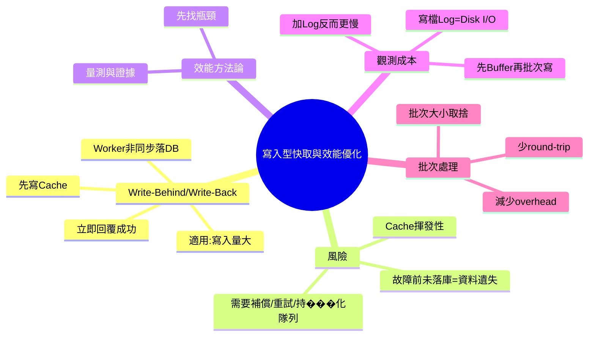

# 📌 本節主題總覽（3~5句摘要）

本節介紹一種「寫入型快取」策略：先把資料寫進快取並立即回覆成功，之後再由背景工作者（worker）非同步批次寫入資料庫，常見名稱是 **Write-Behind / Write-Back**。這種做法用來解決「寫入量很大、資料庫寫入成為瓶頸」的情境，但代價是**資料可能在尚未落盤前就遺失**（例如快取在記憶體，機器重開就沒了）。課程也強調效能優化的第一步永遠是**找瓶頸**，並用「加很多 log 反而更慢」說明：**log 寫檔也是 I/O，會拖垮效能**。最後用批次處理觀念說明：同樣 100 筆資料，一次寫入通常比 100 次單筆寫入快，因為每次操作都有 overhead。

# 🧠 核心觀念拆解

## 1. Write-Behind / Write-Back（寫入延後、先快取後入庫）

- 定義：收到寫入請求時，先把資料寫到快取（通常是記憶體/Redis/佇列），**立即回覆使用者成功**；之後由背景程序（worker）再把資料**非同步、批次**寫入資料庫。
- 為什麼重要（Why）：
    - 當「寫入頻率很高」時，直接同步寫 DB 可能形成瓶頸（DB 寫入慢、鎖競爭、磁碟 I/O、網路延遲）。
    - Write-Behind 能把尖峰寫入「緩衝」起來，提升表面吞吐量與回應時間。
- 運作原理（How）：
    1. API 收到寫入（例如新增掃描紀錄/大量 log）
    2. 寫入快取/緩衝區（快）
    3. 回覆 client 成功（此時 DB 可能還沒寫）
    4. Background worker 週期性或累積到批量後，寫入 DB（慢但有效率）
- 範例（ASP.NET Core MVC：先入隊列，背景服務批次落庫）

```csharp
using System.Collections.Concurrent;

public record LogEvent(DateTime Ts, string Message);

public static class LogBuffer
{
    public static ConcurrentQueue<LogEvent> Queue { get; } = new();
}

// Controller: 先寫入快取/隊列就回覆
public class OpsController : Microsoft.AspNetCore.Mvc.Controller
{
    [HttpPost]
    public IActionResult AddLog(string message)
    {
        LogBuffer.Queue.Enqueue(new LogEvent(DateTime.UtcNow, message));
        return Ok(new { accepted = true }); // DB尚未寫入
    }
}
```

```csharp

using Microsoft.Extensions.Hosting;

public class LogWriterBackgroundService : BackgroundService
{
    private readonly LogRepository _repo;
    public LogWriterBackgroundService(LogRepository repo) => _repo = repo;

    protected override async Task ExecuteAsync(CancellationToken stoppingToken)
    {
        var batch = new List<LogEvent>(capacity: 500);

        while (!stoppingToken.IsCancellationRequested)
        {
            batch.Clear();

            while (batch.Count < 500 && LogBuffer.Queue.TryDequeue(out var e))
                batch.Add(e);

            if (batch.Count > 0)
                await _repo.InsertBatchAsync(batch); // 批次寫入 DB

            await Task.Delay(200, stoppingToken);
        }
    }
}
```

- 常見錯誤：
    - 「回覆成功」被誤解為「一定已寫入 DB」：這會影響商業正確性（交易類通常不允許）。
    - 沒有補償機制：worker 掛掉、快取清空、資料就永久遺失。
    - 沒有設計 backpressure：寫入量 > 消化量，隊列爆記憶體，整台服務被拖死。

## 2. 快取/記憶體的揮發性（Volatile）：資料可能遺失

- 定義：記憶體型儲存（RAM、部分快取）在程式崩潰或機器重開後可能清空；因此「只寫快取」不等於「資料已安全保存」。
- 為什麼重要（Why）：Write-Behind 的核心風險就是「尚未落庫前發生故障」，造成資料遺失。
- 運作原理（How）：
    - DB 寫入通常依賴磁碟（持久化），慢但可靠。
    - Cache 多依賴記憶體，快但不保證持久。
- 範例：
    - 像「寫 10 萬字論文沒存檔」：你以為完成了，其實只是暫存在記憶體。
- 常見錯誤：
    - 把寫入型快取用在不能丟資料的場景（例如扣庫存、財務交易、出貨過帳）。

## 3. 效能優化第一步：先找瓶頸（Bottleneck First）

- 定義：任何效能優化都應先用量測找出最慢的步驟（瓶頸），只優化瓶頸才有明顯收益。
- 為什麼重要（Why）：
    - 若 A 花 1 秒、B 花 10 秒，你把 A 優化到 0.5 秒，整體仍主要被 B 決定。
- 運作原理（How）：
    - 透過 profiling、APM、計時、指標（latency/throughput）定位瓶頸。
- 範例（ASP.NET Core：用計時而不是狂寫檔 log）
    - 用 `Stopwatch` + 指標系統（Prometheus/AppInsights）記錄耗時，而不是每一步都 `File.AppendAllText`。
- 常見錯誤：
    - 沒量測就動手「微優化」。
    - 誤把 CPU/主機規格當唯一解，忽略其實是 DB/I/O 造成。

## 4. 觀測會影響系統：Log 寫檔是 I/O，會讓程式更慢

- 定義：為了找瓶頸加很多 log，如果 log 直接寫磁碟/遠端服務，會產生大量 I/O，反而改變系統行為（Heisenberg effect in observability）。
- 為什麼重要（Why）：你想找「原本的慢」，卻因為觀測手段讓它「更慢」，導致判斷失真。
- 運作原理（How）：
    - 磁碟寫入與 flush 有成本；大量同步 log 會阻塞請求處理。
    - 解法之一：先寫入快取/Buffer，再由背景批次寫入（這正是 Write-Behind 的一種應用）。
- 範例（ASP.NET Core logging 最小化阻塞）：
    - 將 log 寫入 memory channel/queue，背景落盤或送出。
- 常見錯誤：
    - 在高流量路徑用同步 I/O 記錄詳細 log。
    - 以為「加 log 不影響效能」。

## 5. 批次處理（Batching）：一次寫 100 筆通常比寫 100 次快

- 定義：把多次小操作合併成一次大操作，減少每次請求的固定成本（overhead）。
- 為什麼重要（Why）：DB/網路呼叫的固定成本很高；減少 round-trip 次數，通常能顯著提升吞吐。
- 運作原理（How）：
    - 每次 insert/HTTP 呼叫都有：連線、封包、序列化、交易、鎖、commit…等固定成本。
    - 合併後只付一次或較少次固定成本。
- 範例（ASP.NET Core + SQL）：`InsertBatchAsync(logs)` 比 `InsertAsync(log)` 呼叫 100 次更快。
- 常見錯誤：
    - 批次太大：單次交易過重、鎖太久、失敗重試成本高。
    - 不分流：把交易資料也硬做批次，造成一致性/即時性不符合需求。

# 🗺 知識結構圖（Mermaid mindmap）



# 🏗 抽象層級分析

- 這個觀念屬於哪個 abstraction layer？
    - **應用架構層**（Write-Behind、背景工作者）、**資料層**（DB 寫入瓶頸）、**作業系統/I-O 層**（磁碟寫入成本）、**可觀測性層**（logging 對效能影響）。
- 它解決的是哪一種 engineering problem？
    - **高寫入吞吐**、**降低寫入延遲**、**削峰填谷**（把尖峰寫入緩衝後慢慢消化）。
- 有沒有替代方案？
    - 直接擴充 DB（更快磁碟、更多節點、分片）。
    - 用訊息佇列（Kafka/RabbitMQ/Azure Service Bus）作為持久化緩衝。
    - 改寫資料模型：事件溯源（Event Sourcing）、Append-only log。
    - 只針對非關鍵資料採用非同步寫入（例如操作紀錄、追蹤事件）。
- 它的 trade-off 是什麼？
    - **速度/吞吐** vs **一致性/可靠性**（可能丟資料、最終一致）。
    - **架構簡化（先快取）** vs **故障處理複雜化**（重試、補償、去重、順序）。
    - **批次更快** vs **單筆即時性降低**（資料晚一點才進 DB）。

# ⚠ 設計上的陷阱與邊界條件

- **成功語意錯誤**：API 回 `200 OK` 但其實 DB 還沒寫；若用在交易資料會引發嚴重商務錯誤。
- **資料遺失窗口（loss window）**：從寫入快取到落庫之間的時間越長，故障損失越大。
- **重複寫入/順序問題**：worker 重試可能造成重複資料，需要 idempotency（冪等）與去重鍵。
- **緩衝爆炸**：寫入速度長期大於落庫速度，queue/cache 會爆記憶體。
- **批次大小與延遲取捨**：批次越大吞吐越好，但資料「可見」越晚；批次越小延遲較低但 overhead 變多。

# 📘 可加入知識庫的標準定義版本

## 1. Beginner 必須理解

- **Write-Behind（寫回）**：先寫快取/緩衝並回覆成功，稍後再寫入資料庫。
- 這能讓系統「看起來」寫入很快，但有風險：**快取通常在記憶體，可能丟資料**。
- 效能優化第一步是 **先量測找瓶頸**；不要盲目優化。

## 2. Intermediate 必須掌握

- 什麼情境可用：**非關鍵資料**、**寫入量很大**、可接受最終一致（例如追蹤 log、點擊事件）。
- 要配套：背景 worker、批次寫入、重試策略、緩衝上限（backpressure）、監控落庫延遲。
- 知道「log 寫檔是 I/O」會影響效能，應使用 buffer/非同步管線。

## 3. Advanced 才需要深入

- 資料可靠性設計：持久化佇列、Exactly-once/At-least-once、去重、順序保證。
- 災難情境：服務重啟、部分失敗、跨服務一致性與補償交易。
- 容量規劃：尖峰寫入、落庫吞吐、批次大小、延遲 SLA。

**不同層級差異**：  
Beginner 認識「先快取後入庫」與其風險；Intermediate 能在專案中安全落地（加上限制與監控）；Advanced 才處理分散式投遞語意、災難復原與嚴格 SLA。

# 🔗 與其他技術的關聯

- 與資料結構的關聯：
    - Queue/Buffer（佇列）、Batch list、去重集合（HashSet）、Key-based idempotency。
- 與作業系統的關聯：
    - 磁碟 I/O、fsync、context switch；大量同步 I/O 會阻塞請求執行緒。
- 與設計模式的關聯：
    - Producer-Consumer（生產者-消費者）、Buffer、Batching、Outbox（可靠事件寫出）概念。
- 與實務開發的關聯：
    - ASP.NET Core 常用 `BackgroundService` 寫 worker；搭配 Redis/Queue/Message Broker 進行緩衝與批次落庫。
    - Logging 應避免阻塞式寫檔，改用非同步 sink 或集中式 log 管線。

# 🚀 實務應用場景

在真實專案（例如成衣製造的 MES / 產線系統）常見兩類「寫多」情境：

1. **掃描/報工事件大量湧入**（每件、每道工序都上報）：可先寫入事件緩衝（快取/佇列），由 worker 批次寫 DB，避免 DB 被瞬間寫爆。
2. **高頻操作記錄與稽核 log**（每次查詢、每次操作都記錄）：若同步寫檔/寫 DB 會拖慢主流程，可改為 Write-Behind，允許「稍後落庫」。

但若是 **扣庫存、財務對帳、出貨過帳** 這種「不能丟、不能晚」的資料，就不適合用「先回成功、後寫 DB」；通常要改成同步交易或使用具持久化保證的訊息佇列與 Outbox 模式來確保可靠性。