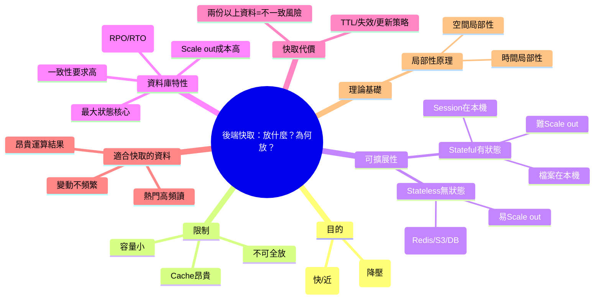

# 📌 本節主題總覽（3~5句摘要）

本節從「後端快取要放什麼資料」出發，先釐清快取的兩個核心目的：**降低讀取延遲**與**保護資料庫（減少 DB 壓力）**。接著補充雲端常見的可擴展性觀念：後端服務要盡量做成 **Stateless（無狀態）** 才能容易水平擴充（Scale out），而狀態（Session、檔案）應搬到外部服務（如 Redis、S3）。但資料庫本身是「最大的狀態」，難以便宜地 scale out，因此系統設計常會傾向「讓 Web 層累一點、保護 DB」。最後整理哪些資料適合快取：**熱門且常被讀**、**計算昂貴的結果**，但共同前提是 **不要太常變動**，否則會造成快取失效成本高與資料不一致風險；並引入「局部性原理（時間/空間）」做為快取命中率的理論基礎。

# 🧠 核心觀念拆解

## 1. 快取的目的：快 + 近，以及保護資料庫

- 定義：快取（Cache）是將常用資料或運算結果放在更快/更近的層（通常是記憶體或近端服務），以降低存取原始資料（多為 DB/磁碟）的成本。
- 為什麼重要（Why）：
    - **延遲降低**：RAM/Redis 通常比 DB(磁碟+網路)快。
    - **DB 壓力降低**：熱門資料若不快取，可能造成 DB 被大量重複查詢打爆。
- 運作原理（How）：
    - 多數架構採「Cache-Aside」：先查快取，Miss 才查 DB 並回寫快取。
    - 快取命中 → 省掉 DB round-trip 與 DB 查詢成本。
- 範例（成衣廠 / ASP.NET Core MVC）：
    - 「工單明細」或「線別今日 WIP 統計」被大量查詢：用 Redis 快取 30 秒～5 分鐘，減少 DB 查詢。
- 常見錯誤：
    - 只為了「快」而快取，卻沒想「DB 壓力」與「命中率」：結果快取成本高但效益低。
    - 直接把整個資料庫資料塞快取（不可能，容量/成本不允許）。

## 2. 容量與成本限制：不可能快取全部資料

- 定義：資料庫可能是 TB 等級；快取通常只有數 GB～數十 GB，而且更昂貴。
- 為什麼重要（Why）：你必須做「資料選擇題」：哪些值得放快取、哪些不值得。
- 運作原理（How）：
    - 快取容量有限 → 必然淘汰（eviction）與過期（TTL）。
    - 選錯資料會導致 Hit Rate 低、浪費記憶體與費用。
- 範例：
    - 存「最近 7 天工單查詢結果」可能有價值；存「10 年前歷史報表明細」通常沒價值。
- 常見錯誤：
    - 快取 key 設計太分散（例如每種查詢條件都快取）造成爆量 key、命中率反而低。

## 3. Stateful vs Stateless：狀態會讓 Scale out 變困難

- 定義：
    - **Stateful（有狀態）**：伺服器記住會影響後續請求的資訊（例如 Session 存在本機、圖片檔存在本機磁碟）。
    - **Stateless（無狀態）**：伺服器不依賴本機狀態；任何一台機器都能處理同一使用者的請求。
- 為什麼重要（Why）：
    - Stateless 才能簡單地水平擴充（加機器）並提升可用性（某台掛了可切走）。
- 運作原理（How）：
    - 負載平衡器常用 Round Robin 把請求輪流分配到不同 Web Server。
    - 若狀態在某台機器本機：下一次請求被分到另一台就「找不到狀態」（圖片不見、Session 失效）。
- 範例（ASP.NET Core MVC：把 Session/登入狀態移出 Web Server）
    - 使用 JWT（Token）避免 Server-side Session。
    - 或把 Session 存到 Redis（分散式 Session）。

```csharp

var builder = WebApplication.CreateBuilder(args);

builder.Services.AddControllersWithViews();

// 分散式 Session（示意）：實務上可改用 Redis 分散式快取
builder.Services.AddDistributedMemoryCache();
builder.Services.AddSession(options =>
{
    options.IdleTimeout = TimeSpan.FromMinutes(30);
});

var app = builder.Build();
app.UseSession();
app.MapDefaultControllerRoute();
app.Run();

```

- 常見錯誤：
    - 把上傳檔案存在 Web Server 本機資料夾，卻又開多台機器，導致讀不到檔案。
    - 使用 Cookie+Server Session 但沒有分散式 Session，造成登入狀態飄移。

## 4. 為什麼要「保護資料庫」：DB 是最難擴充、最難復原的狀態核心

- 定義：資料庫承載系統的權威資料（訂單、庫存、工單），一致性要求高、擴充成本高，且資料損毀的復原代價巨大。
- 為什麼重要（Why）：
    - Web Server 可 scale out 很多台；但 DB 被打爆時，前面開再多台也沒用。
    - DB 故障即使有備份也有時間差（RPO），可能遺失最近幾秒/幾分鐘的新訂單或報工。
- 運作原理（How）：
    - 常見策略：讓 Web/App 層做更多運算與快取，降低 DB 查詢與寫入壓力。
- 範例（成衣廠）：
    - 大促銷或產線集中報工 → 流量暴增。Web 可擴、DB 不好擴 → 用快取減少重複讀，並避免 DB 掛掉。
- 常見錯誤：
    - 只盯著 Web CPU/RAM，忽略 DB connection pool、慢查詢、鎖競爭才是真瓶頸。

## 5. 快取的代價：資料不一致（Staleness）一定會出現

- 定義：同一份資料同時存在 DB 與 Cache（兩處以上）就可能因時間差、失效策略或更新失敗而不一致。
- 為什麼重要（Why）：不一致會直接影響業務正確性（例如庫存顯示錯、工單狀態錯）。
- 運作原理（How）：
    - DB 更新了，但快取尚未失效/更新 → 讀到舊資料。
    - 解法包含：TTL、Invalidate、Write-through、事件驅動刷新等（依需求選）。
- 範例：
    - 庫存剛扣掉，但快取還是舊數字，導致超賣或備料錯誤。
- 常見錯誤：
    - TTL 設太長且沒有更新時刪快取（Invalidate），造成長時間讀到舊資料。

## 6. 哪些資料適合放快取？（選擇準則）

- 定義：適合快取的資料通常具備「高重複讀取價值」或「重算成本高」，且變動不頻繁。
- 為什麼重要（Why）：快取容量有限，必須把資源用在最能���升 Hit Rate、最能減少 DB 壓力的地方。
- 運作原理（How）：常見三條判斷線
    1. **熱門資料（Hot Data）**：被大量重複讀取
    2. **昂貴運算結果**：報表/聚合/跨多表計算很久
    3. **變動不頻繁**：否則快取一直更新，效益被抵消
- 範例（成衣廠）：
    - 熱門：今日工單列表、線別看板指標、常用字典檔（工序代碼、尺寸表）。
    - 昂貴：跨多表的「交期風險報表」可快取 5~15 分鐘（或用離線預計算）。
- 常見錯誤：
    - 把「每秒都在變的即時數據」快取很久，造成嚴重過時。
    - 把「很少人看的資料」快取，命中率低，浪費資源。

## 7. 局部性原理（Locality）：時間局部性與空間局部性

- 定義：
    - **時間局部性**：某資料被存取後，短時間內很可能再次被存取。
    - **空間局部性**：某資料被存取後，附近資料（相鄰 key/相鄰記錄）也可能被存取。
- 為什麼重要（Why）：快取能有效，背後常靠局部性；理解它有助於設計更好的快取 key、批次載入與預取（prefetch）。
- 運作原理（How）：
    - DB/OS 也利用空間局部性做 page cache、read-ahead。
    - 應用層可用：同頁面需要的多筆資料一次抓、一次快取，減少 round-trip。
- 範例：
    - 使用者開「工單 WO123」後，常接著看「WO124/同批工單」或「同款式工單」→ 空間局部性。
- 常見錯誤：
    - 完全不利用局部性，導致 N+1 Query（一筆一筆查），DB 壓力倍增。

# 🗺 知識結構圖（Mermaid mindmap）



# 🏗 抽象層級分析

- 這個觀念屬於哪個 abstraction layer？
    - **系統架構層**（stateless/scale out/保護 DB）、**資料層**（DB 一致性與備份風險）、**應用層**（快取選型與 key/TTL 設計）、**理論層**（locality）。
- 它解決的是哪一種 engineering problem？
    - **效能（latency/throughput）**、**可擴展性（scalability）**、**穩定性（DB 保護、抗峰值）**。
- 有沒有替代方案？
    - DB 優化（索引、查詢重寫、讀寫分離）。
    - 生成物化結果（materialized view / 預先計算報表）。
    - CDN/Proxy 快取（針對靜態或可快取的 HTTP 回應）。
- 它的 trade-off 是什麼？
    - **更快** vs **可能過時/不一致**
    - **保護 DB** vs **系統複雜度上升（失效策略、監控）**
    - **Stateless 易擴** vs **狀態外移帶來額外服務依賴（Redis/S3）**

# ⚠ 設計上的陷阱與邊界條件

- **快取一致性沒定義清楚**：哪些頁面允許 30 秒舊資料？哪些不行（例如庫存/出貨）？
- **把 Session/檔案留在本機**：一旦 scale out 就會出現「偶發登出/圖片不見」這類難查問題。
- **錯誤的快取對象**：變動太頻繁的資料快取，導致不停更新、命中率低、甚至讀到舊資料造成事故。
- **DB 被打爆是系統級災難**：Web 開再多台無效；要優先做 DB 保護（快取、限流、降級）。
- **未利用局部性**：頁面需要 50 筆資料就做 50 次 DB query（N+1），把 DB 壓力放大。

# 📘 可加入知識庫的標準定義版本

## 1. Beginner 必須理解

- 快取的核心價值是：**把常用資料放在更快/更近的地方**，以減少讀 DB 的次數與延遲。
- 因為快取昂貴且容量小，所以不可能快取全部資料；要挑「值得快取」的資料。
- 只要資料同時存在 DB 與 Cache，就可能出現**不一致（讀到舊資料）**。

## 2. Intermediate 必須掌握

- Stateless/Stateful 的差異與 scale out 的原因：狀態應外移（S3、Redis、DB）。
- 快取選擇準則：**熱門（讀多）**、**昂貴運算結果**、且**不常變動**。
- 能設計基本策略：Cache key、TTL、更新時 Invalidate，並定義可接受的「資料新鮮度」。

## 3. Advanced 才需要深入

- 用局部性原理提升命中率（prefetch、批次載入、避免 N+1）。
- DB 保護策略全套：限流、熔斷、降級、讀寫隔離、快取雪崩處理。
- 依不同資料類型設計一致性模型（強一致/最終一致）與可觀測性（hit rate、staleness、回源量）。

**不同層級差異**：  
Beginner 先懂「為何快取有效、為何不能全放」。Intermediate 能在專案中做出「可用且不常出事」的快取選擇。Advanced 才處理大規模下的一致性、局部性最佳化與 DB 防護的系統性方案。

# 🔗 與其他技術的關聯

- 與資料結構的關聯：
    - Key-Value（Dictionary/HashMap）、淘汰策略（LRU/LFU）、批次載入與集合操作。
- 與作業系統的關聯：
    - Page cache、read-ahead（空間局部性）、記憶體成本與 I/O 延遲差距。
- 與設計模式的關聯：
    - Cache-Aside、Proxy、Decorator；Stateless 也常搭配 Twelve-Factor App 思維。
- 與實務開發的關聯：
    - ASP.NET Core 常用 Redis（`IDistributedCache`）存快取或分散式 Session；檔案用 S3/Blob；登入多用 JWT。

# 🚀 實務應用場景

以成衣製造公司的系統來說，你會用這段觀念做出「快取放什麼」的決策：

- **Scenario：產線看板暴增流量，DB 快扛不住**
    
    - 角色：產線主管、IE 工程師、廠長同時盯看板
    - 商業需求：看板允許 10~30 秒內的輕微延遲，但不能當機
    - 操作流程：大量使用者反覆刷新同一組 KPI（WIP、達成率、瓶頸站）
    - 預期資料：KPI 聚合結果（讀多、變動頻率中等）
    - 作法：把 KPI 結果快取在 Redis（短 TTL），更新來源仍以 DB 為準；Web 層可 scale out，DB 壓力大幅下降。
- **Scenario：庫存/出貨資料不適合長快取**
    
    - 角色：倉管、出貨人員
    - 商業需求：庫存必須接近即時，錯了會造成超賣/漏出
    - 作法：即使快取也只能短 TTL 或在寫入時強制 Invalidate；必要時直接查 DB 或採用更嚴謹一致性方案。