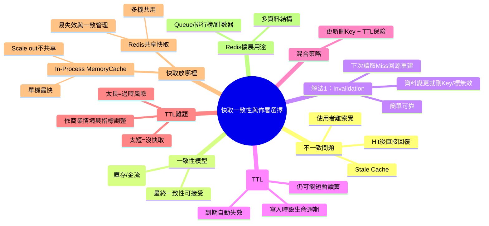

# 📌 本節主題總覽（3~5句摘要）

本節聚焦在「快取與資料庫有兩份資料時，如何處理不一致」：當 DB 已更新但快取仍是舊資料，使用者因為命中快取（Hit）而不自覺讀到過時資料（Stale Cache）。課程介紹兩種常見的避免方式：**快取失效（Invalidation）**與**快取過期（Expiration/TTL）**，並指出 TTL 長短沒有標準答案，需依商業情境取捨。接著說明「快取放哪裡」：放在**單機記憶體（In-Process MemoryCache）**最快但只對單機有效、難以 scale out；放在**獨立 Redis**可多台共用、利於水平擴充。最後補充 Redis 不只是快取，還提供多種資料結構，可作為重要學習素材。

# 🧠 核心觀念拆解

## 1. Stale Cache（快取過時 / 資料不一致）

- 定義：原始資料來源（DB）已更新，但快取（Cache）仍保留舊值；讀取流程若先查快取且命中（Hit），就會把舊值回給使用者。
- 為什麼重要（Why）：
    - 會造成「使用者看到的資料」與「DB 真實資料」不一致。
    - 對某些業務（金融交易、庫存扣減、出貨）是不可接受的；但對某些指標（觀看數、按讚數）可能可接受。
- 運作原理（How）：
    - 讀取採 Cache-Aside：先查 cache → Hit 直接回傳 → 不會去 DB 驗證是否最新。
    - 因此只要快取沒被更新/失效，就有過時風險。
- 範例（成衣廠 / ASP.NET Core MVC）：
    - 工單狀態 DB 已從「裁剪中」改成「已裁剪」，但快取仍是舊狀態，產線看板顯示錯誤。
- 常見錯誤：
    - 假設「快取命中就一定是最新」。
    - 沒有針對資料類型定義可接受的「新鮮度（staleness）」。

## 2. 最終一致性（Eventual Consistency）：何時可以接受「短暫不一致」

- 定義：系統允許資料在短時間內不一致，但最終會同步到一致狀態。
- 為什麼重要（Why）：
    - 讓系統能用快取換取效能與可擴充性。
    - 不是所有資料都需要強一致；錯把「可容忍」當「不可容忍」會讓成本暴增。
- 運作原理（How）：
    - 快取透過 TTL 或後台同步機制，延遲一段時間後與 DB 對齊。
- 範例：
    - YouTube 觀看數、社群按讚數：差幾個通常不影響決策，也難以驗證「正確即時值」。
- 常見錯誤：
    - 把最終一致性用在「庫存/金流」等必須強一致的場景。

## 3. Cache Invalidation（快取失效/作廢）：更新時把快取標為無效或直接刪除

- 定義：當原始資料變更（通常是 Update/Delete/Insert 影響查詢結果）時，將對應快取 key **標記為無效或移除**，避免後續讀到舊資料。
- 為什麼重要（Why）：
    - 這是最常見、也相對可靠的方式：先確保「不會長期讀舊」，再由下一次讀取者回源重建快取。
- 運作原理（How）：
    1. 後台/系統更新 DB 成功
    2. `Remove(cacheKey)`（或設為 invalid）
    3. 下一次讀取時視為 Miss → 查 DB → 回寫 cache
- 範例（ASP.NET Core MVC：更新工單後刪快取）

```csharp
using Microsoft.Extensions.Caching.Distributed;

public class WorkOrderAdminService
{
    private readonly WorkOrderRepository _repo;
    private readonly IDistributedCache _cache;

    public WorkOrderAdminService(WorkOrderRepository repo, IDistributedCache cache)
    {
        _repo = repo;
        _cache = cache;
    }

    public async Task UpdateStatusAsync(string woNo, string newStatus)
    {
        await _repo.UpdateStatusAsync(woNo, newStatus);

        // 失效策略：簡單、有效，避免長期讀到舊資料
        await _cache.RemoveAsync($"workorder:{woNo}");
    }
}

```

- 常見錯誤：
    - 更新 DB 但忘了失效快取 → 舊資料一直存在。
    - cache key 命名不一致，導致刪不到正確 key（變成「以為失效了，其實沒有」）。

## 4. Cache Expiration / TTL（快取過期）：設定生命週期自動失效

- 定義：寫入快取時設定 TTL（Time To Live），到期後該快取自動過期，讀取時就會 Miss 並回源更新。
- 為什麼重要（Why）：
    - 不需要每次資料變更都精準刪 key（減少耦合）。
    - 能保證「最晚在 TTL 時間內會更新一次」（前提是有人讀）。
- 運作原理（How）：
    - 設 TTL = 5 秒：代表最壞情況下，資料最多可能舊 5 秒（但期間 DB 若更新，仍可能短暫讀舊）。
- 範例（ASP.NET Core：設定分散式快取 TTL）

```csharp
using System.Text.Json;
using Microsoft.Extensions.Caching.Distributed;

public class WorkOrderService
{
    private readonly IDistributedCache _cache;
    private readonly WorkOrderRepository _repo;

    public WorkOrderService(IDistributedCache cache, WorkOrderRepository repo)
    {
        _cache = cache;
        _repo = repo;
    }

    public async Task<WorkOrderDto> GetAsync(string woNo)
    {
        var key = $"workorder:{woNo}";
        var cached = await _cache.GetStringAsync(key);

        if (!string.IsNullOrEmpty(cached))
            return JsonSerializer.Deserialize<WorkOrderDto>(cached)!;

        var dto = await _repo.GetWorkOrderDtoAsync(woNo);

        await _cache.SetStringAsync(
            key,
            JsonSerializer.Serialize(dto),
            new DistributedCacheEntryOptions
            {
                AbsoluteExpirationRelativeToNow = TimeSpan.FromSeconds(30) // TTL
            });

        return dto;
    }
}
```

- 常見錯誤：
    - TTL 設太短：一直 Miss、一直打 DB，等同沒快取。
    - TTL 設太長：資料長時間過時，造成業務錯誤。

## 5. Invalidation + TTL 混用（實務上最常見）

- 定義：同時使用「更新時刪快取」與「TTL 自動過期」兩種機制。
- 為什麼重要（Why）：
    - Invalidation 防止長期讀舊；TTL 防止漏刪 key 或異常情境下快取永遠不更新。
- 運作原理（How）：
    - 重要資料：更新時一定刪 key；同時仍設 TTL 作為保險絲（safety net）。
- 範例：
    - 工單狀態更新 → 立即 Remove；同時工單詳情 cache TTL 仍設 5 分鐘以防漏刪。
- 常見錯誤：
    - 只靠 TTL 但 TTL 設很長，導致「更新後很久才看到新資料」。

## 6. TTL 沒有標準答案：Computer Science 的難題之一

- 定義：TTL 應設多長取決於「商業可接受的過時時間」與「DB 壓力/成本」，沒有通用最佳解。
- 為什麼重要（Why）：
    - TTL 太短 → 快取效益消失、DB 壓力回來。
    - TTL 太長 → staleness 過高、用戶/業務決策錯誤。
- 運作原理（How）：
    - 依下列因素調整：
        - 資料更新頻率（多久會變）
        - 讀取頻率（多熱門）
        - 可接受的 staleness（例如最多舊 10 秒？1 分鐘？）
        - Hit rate 與回源量（metrics）
- 範例：
    - 「今日產線 KPI」可接受 10 秒延遲：TTL 可設 5~15 秒。
    - 「庫存數量」不可接受舊值：TTL 很短 + 必須 Invalidate（或乾脆不快取）。
- 常見錯誤：
    - 靠「心情」設 TTL，不看指標與需求。
    - 沒有把 TTL 與業務風險連結（例如超賣）。

## 7. 快取放哪裡：In-Process MemoryCache vs 共享 Redis

- 定義：
    - **In-Process MemoryCache**：快取存在應用程式所在機器的記憶體中（最快、最便宜）。
    - **Redis（獨立快取服務）**：快取放在獨立節點，多台 Web Server 共用（可擴充、可一致失效）。
- 為什麼重要（Why）：
    - 一旦��統需要 scale out（多台機器），單機快取會變成「每台各一份」，難以共享與一致更新。
- 運作原理（How）：
    - 單機快取：只對該台有效；其他台看不到，也無法可靠地被後台更新觸發失效。
    - Redis：集中式/共享式狀態，所有 Web 節點一致讀寫與失效。
- 範例（ASP.NET Core MVC：MemoryCache 只適合單機或非關鍵快取）

```csharp
using Microsoft.Extensions.Caching.Memory;

public class StyleDictionaryService
{
    private readonly IMemoryCache _cache;
    private readonly StyleRepository _repo;

    public StyleDictionaryService(IMemoryCache cache, StyleRepository repo)
    {
        _cache = cache;
        _repo = repo;
    }

    public Task<List<StyleDto>> GetStylesAsync()
    {
        return _cache.GetOrCreateAsync("styles:all", async entry =>
        {
            entry.AbsoluteExpirationRelativeToNow = TimeSpan.FromMinutes(10);
            return await _repo.GetAllStylesAsync();
        })!;
    }
}
```

- 常見錯誤：
    - 已經有 Load Balancer 還用單機快取當共享快取，導致不同節點資料不一致。
    - 後台更新資料後，只刪了某一台的快取，其他台仍是舊的。

## 8. Redis 不只是快取：多種資料結構可支援更多用途

- 定義：Redis 除了 Key-Value 快取，還提供 List/Set/Sorted Set/Hash 等資料結構，可做 Queue、排行榜、計數器、分散式鎖等。
- 為什麼重要（Why）：對初學者來說，Redis 是理解「資料結構 + 系統設計」的好材料。
- 運作原理（How）：不同結構對應不同存取模式（例如 Sorted Set 做排名、List 做佇列）。
- 範例（成衣廠）：
    - 用 Sorted Set 做「最常被查詢的工單 Top N」統計，輔助找熱點快取。
- 常見錯誤：
    - 把 Redis 當成萬能資料庫使用，忽略持久性與一致性需求。

# 🗺 知識結構圖（Mermaid mindmap）



# 🏗 抽象層級分析

- 這個觀念屬於哪個 abstraction layer？
    - **應用架構層**（快取策略、TTL/失效）、**分散式系統層**（一致性模型、scale out）、**部署層**（LB + 多節點）、**資料層**（DB 作為權威來源）。
- 它解決的是哪一種 engineering problem？
    - **效能（降低延遲、減少 DB round-trip）**、**可擴充（多節點共用狀態）**、以及在可接受範圍內控制 **資料新鮮度與一致性**。
- 有沒有替代方案？
    - 不快取：直接靠 DB 優化（索引、讀寫分離）。
    - 物化/預計算：用報表表、materialized view。
    - 事件驅動刷新：DB 變更事件推送更新快取（更複雜）。
- 它的 trade-off 是什麼？
    - **速度** vs **正確性（staleness）**
    - **簡單（TTL）** vs **更即時（Invalidation）**
    - **單機極快（MemoryCache）** vs **多機一致（Redis）**（但 Redis 多一個網路 hop 與營運成本）

# ⚠ 設計上的陷阱與邊界條件

- **把最終一致性用在不該用的地方**：庫存/扣料/出貨若讀到舊值會造成實際損失。
- **只靠 TTL**：資料更新後到 TTL 到期前仍可能讀舊。
- **TTL 設太短**：造成 cache churn（一直過期一直回源），DB 壓力上升。
- **In-Process 快取在多台機器下失控**：節點間不共享、失效不同步，出現「有時新、有時舊」。
- **Cache key 命名與範圍不清**：刪 key 刪不準或刪不乾淨，導致舊資料殘留。

# 📘 可加入知識庫的標準定義版本

## 1. Beginner 必須理解

- 快取會讓讀取更快，但資料可能過時（Stale Cache）。
- 兩個常見手段：
    - **Invalidation**：資料更新就刪快取
    - **TTL**：快取到期自動失效
- TTL 沒有標準值，必須看「可接受多舊」與「DB 壓力」。

## 2. Intermediate 必須掌握

- 能依資料重要性選一致性：指標類可最終一致；交易類需更強一致。
- 能設計：cache key、Invalidate 點（哪些更新要刪哪些 key）、TTL 與監控（hit rate、回源量）。
- 理解 MemoryCache 只對單機有效；scale out 時多數會改用 Redis 共享快取。

## 3. Advanced 才需要深入

- 混合策略與故障模式：漏刪 key、批次更新、雪崩、擊穿、熱點。
- 事件驅動快取刷新、雙寫一致性、可觀測性（staleness 指標）。
- Redis 多資料結構與進階用法（queue、限流、鎖）在系統設計中的角色。

**不同層級差異**：  
Beginner 知道「快取會舊、要 TTL/刪除」。Intermediate 能把快取放對位置、刪對 key、設合理 TTL。Advanced 面對大流量/多服務時處理一致性與故障模式。

# 🔗 與其他技術的關聯

- 與資料結構的關聯：
    - LRU/TTL、Key-Value、以及 Redis 的 Hash/List/Set/Sorted Set。
- 與作業系統的關聯：
    - 記憶體 vs 磁碟延遲差；快取淘汰與記憶體壓力；時間/空間局部性（間接影響命中率）。
- 與設計模式的關聯：
    - Cache-Aside、Write-through/Write-behind（延伸）、Decorator（包裝一層快取）、Proxy。
- 與實務開發的關聯：
    - ASP.NET Core 的 `IMemoryCache`、`IDistributedCache`（Redis 實作），以及在多節點下如何做一致失效。

# 🚀 實務應用場景

以成衣製造系統來看，這段內容會這樣落地：

- **Scenario 1：產線看板（允許最終一致）**
    
    - 角色：產線主管、廠長
    - 需求：看板不卡，數字允許延遲 10 秒
    - 作法：Redis 快取 KPI 結果，TTL=10 秒；更新事件不一定每次都 Invalidate（用 TTL 自然修正）
- **Scenario 2：工單狀態/派工（需要接近即時）**
    
    - 角色：線長、排程人員
    - 需求：狀態錯會造成派工錯誤
    - 作法：更新工單狀態後必做 Invalidate；TTL 仍設 1~5 分鐘當保險絲
- **Scenario 3：庫存扣減（不建議靠快取維持正確）**
    
    - 角色：倉管、出貨
    - 需求：不可超賣/不可顯示舊庫存
    - 作法：庫存以 DB 為準（或用更嚴格的一致性方案），快取僅作短 TTL 的讀加速，且必須搭配更新時失效與防止讀舊的設計