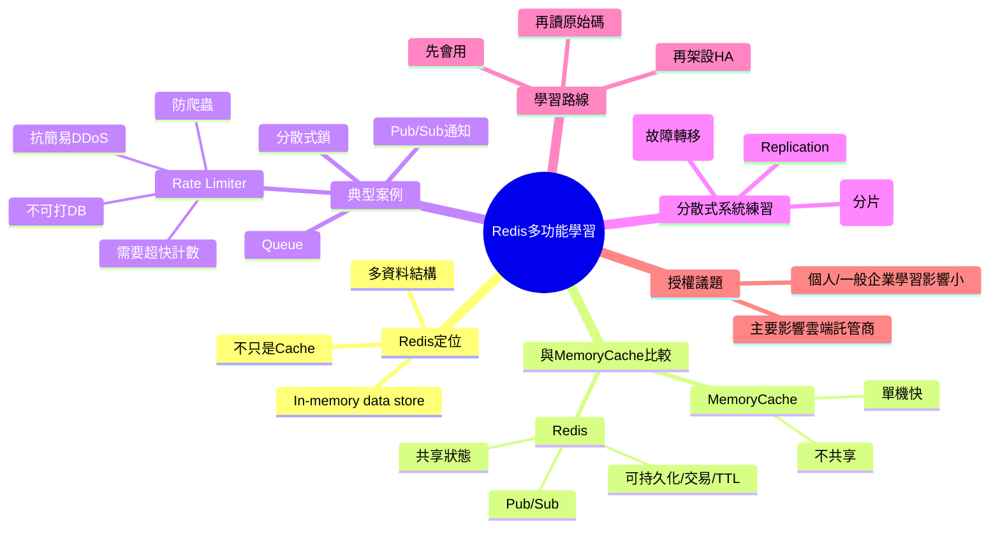

# 📌 本節主題總覽（3~5句摘要）

本節核心訊息是：**Redis 不只是快取**，它同時提供多種資料結構、持久化、交易、Pub/Sub 等能力，適合轉職與初學者用來練習資料結構與系統設計。講者用 **Rate Limiter（限流）** 舉例：這種元件必須非常快、又需要記憶狀態，不能用資料庫做計數，最常用 Redis 來存每個 IP 的請求次數。並進一步指出 Redis 也能當 Queue、分散式鎖，甚至可透過 replication、sentinel、cluster 來學分散式系統。最後提到 Redis 授權變更主要影響雲端託管廠商，對個人學習與一般企業自用影響不大；建議循序漸進：先會用，再看原始碼理解高效能背後的設計。

# 🧠 核心觀念拆解

## 1. Redis 是「多用途」的 In-Memory Data Store

- 定義：Redis 是以記憶體為主的資料儲存系統（in-memory data store），除了做快取（cache），也能提供資料結構操作、訊息傳遞、計數、鎖等能力。
- 為什麼重要（Why）：
    - 對初學者：能用一套工具同時練 **資料結構**、**快取設計**、**分散式系統基礎**。
    - 對工程實務：能解決「需要快、需要狀態、又不想打 DB」的常見問題。
- 運作原理（How）：
    - 資料主要放在 RAM → 存取延遲低。
    - 提供多種結構（String/Hash/List/Set/Sorted Set…）與原子操作，適合做計數、佇列、排行榜等。
- 範例：
    - 成衣廠：用 Sorted Set 做「最常被查詢的工單 Top N」，協助找熱點資料再做快取優化。
- 常見錯誤：
    - 把 Redis 當成「永不丟資料的資料庫」使用（忽略它仍可能因配置/淘汰/故障而丟資料）。
    - 不理解資料結構差異，所有需求都用同一種 key-value 存法，導致效能與維護性差。

## 2. Redis vs MemoryCache：功能與適用情境

- 定義：
    - **MemoryCache（In-Process Cache）**：快取存在單一應用程式進程的記憶體，通常只提供簡單 key-value 與過期。
    - **Redis**：獨立服務，可多台應用共用，並支援持久化、交易、Pub/Sub、多資料結構等。
- 為什麼重要（Why）：
    - 你一旦有 Load Balancer + 多台 Web Server，MemoryCache 只對單機有效，跨機器不同步。
    - Redis 可做共享快取與共享狀態，支援 scale out。
- 運作原理（How）：
    - MemoryCache：快、簡單、無網路 hop，但不共享、重啟就清空。
    - Redis：多一個網路 hop，但可共享、可擴展，功能更完整。
- 範例（ASP.NET Core MVC：限流必須共享狀態，適合 Redis）
    - 多台 Web Server 都必須看到「同一個 IP 已經打了幾次」。
- 常見錯誤：
    - 多台機器卻用 MemoryCache 做全域限流/Session，造成各台計數不一致。

## 3. Rate Limiter（限流）：防爬蟲與抗簡易 DDoS 的基本手段

- 定義：Rate Limiter 依某個維度（常見：IP、UserId、API Key）限制請求頻率，例如「每秒最多 10 次請求」，超過就拒絕或降速。
- 為什麼重要（Why）：
    - Web Server 無法靠「看請求長相」就分辨正常用戶與攻擊者；只能靠行為特徵（頻率）做第一層防護。
    - 若限流做得太慢，反而成為瓶頸，拖垮整站。
- 運作原理（How）：
    - 每次請求到來：對某個 key 做計數（count），並以時間窗（window）判斷是否超過門檻。
    - 計數必須很快、且是共享狀態 → 不適合寫入資料庫 → 常用 Redis 原子遞增。
- 範例（ASP.NET Core MVC：簡化版「固定視窗」限流示意）

```csharp
using Microsoft.AspNetCore.Mvc;
using Microsoft.Extensions.Caching.Distributed;

public class RateLimitController : Controller
{
    private readonly IDistributedCache _cache;

    public RateLimitController(IDistributedCache cache)
    {
        _cache = cache;
    }

    // 示意：每個IP每秒最多10次（固定視窗，教學用）
    [HttpGet("/api/ping")]
    public async Task<IActionResult> Ping()
    {
        var ip = HttpContext.Connection.RemoteIpAddress?.ToString() ?? "unknown";
        var windowKey = $"rl:{ip}:{DateTime.UtcNow:yyyyMMddHHmmss}"; // 每秒一個key

        var current = await _cache.GetStringAsync(windowKey);
        var count = (current is null) ? 1 : int.Parse(current) + 1;

        // 第一次寫入時設定 TTL = 2 秒，讓視窗自動消失
        await _cache.SetStringAsync(windowKey, count.ToString(),
            new DistributedCacheEntryOptions
            {
                AbsoluteExpirationRelativeToNow = TimeSpan.FromSeconds(2)
            });

        if (count > 10)
            return StatusCode(429, "Too Many Requests");

        return Ok(new { ok = true, count });
    }
}
```


- 常見錯誤：
    - 用資料庫記錄每次請求（太慢、會把 DB 打爆）。
    - 限流 key 設計不當（只用 IP，忽略 NAT/公司出口 IP 造成誤傷）。
    - 沒考慮分散式情境（多台 Web 計數不一致）。

## 4. Redis 的其他常見用途：Queue、Pub/Sub、分散式鎖

- 定義：
    - **Queue（佇列）**：暫存待處理任務，讓 worker 背景消化（簡易版）。
    - **Pub/Sub**：發布/訂閱訊息，快速通知（較輕量，非可靠訊息佇列）。
    - **Distributed Lock（分散式鎖）**：跨多台服務協調「同一時間只能一個人做」的工作（例如排程結算）。
- 為什麼重要（Why）：
    - 這些都是後端常見的「跨機器協調」需求，Redis 提供相對容易入門的工具箱。
- 運作原理（How）：
    - 利用 Redis 的原子操作與資料結構，完成「排隊、通知、互斥」等能力。
- 範例（成衣廠）：
    - 同一筆工單的「自動派工」避免重複派送：用分散式鎖確保同時間只有一個排程在跑。
- 常見錯誤：
    - 把 Pub/Sub 當成可靠訊息佇列（它不保證持久與必達）。
    - 分散式鎖沒設定過期，造成死鎖。

## 5. 用 Redis 學分散式系統：Replication / Sentinel / Cluster

- 定義：
    - **Replication**：資料複寫，提高可用性與讀擴展。
    - **Sentinel**：監控與故障轉移（Failover）機制。
    - **Cluster**：分片（sharding）與水平擴展。
- 為什麼重要（Why）：
    - 初學者常難以「安全地練習」分散式系統；Redis 輕量、好架設，適合做 lab。
- 運作原理（How）：
    - 透過主從/哨兵/分片節點的協作，學到高可用與擴展的基本概念。
- 範例：
    - 在本機或小規格 VM 建 3~6 個 Redis 節點練 cluster（比起 MySQL replication 更容易啟動）。
- 常見錯誤：
    - 只看教學照做，不理解「故障時誰選主、資料一致性如何保證」。

## 6. 授權變更的實務影響：主要衝擊雲端託管商，不影響個人學習

- 定義：Redis 在較新版本調整授權條款，主要針對「雲端廠商提供託管服務但未回饋」的商業模式衝突。
- 為什麼重要（Why）：很多人聽到授權就以為「不能用」而停止學習；但多數個人/一般企業自用不受影響（至少不會是你入門的障礙）。
- 運作原理（How）：授權影響的是「託管再販售」這類情境；自建或一般使用多可行。
- 範例：
    - 雲端上仍可用類似服務（可能是兼容版本或替代方案），學習面不必被嚇退。
- 常見錯誤：
    - 把「授權新聞」直接等同於「技術不值得學」。

## 7. 學習路線：先會用，再看原始碼理解高效能設計

- 定義：先用 Redis 解決具體問題（快取、限流、Queue、鎖），再進一步閱讀原始碼或相關書籍理解內部資料結構與效能設計。
- 為什麼重要（Why）：沒有使用經驗就看原始碼，往往缺乏「問題感」，吸收效率低。
- 運作原理（How）：
    1. 用案例練 API 與設計
    2. 練部署與 HA（sentinel/cluster）
    3. 再進原理（資料結構、事件迴圈、網路模型等）
- 範例：
    - 先做：用 Redis 實作 rate limiter → 再研究它為何能高效支援原子遞增與過期。
- 常見錯誤：
    - 一開始就追求「看懂全部底層」，反而卡住放棄。

# 🗺 知識結構圖（Mermaid mindmap）





# 🏗 抽象層級分析

- 這個觀念屬於哪個 abstraction layer？
    - **應用層/系統設計層**（限流、快取、佇列、鎖）、**資料結構層**（Redis structures）、**分散式系統層**（replication/sentinel/cluster）、以及部分 **營運/產品層**（授權與託管服務選型）。
- 它解決的是哪一種 engineering problem？
    - **低延遲狀態存取**、**共享狀態**、**流量保護（rate limiting）**、**簡易協調（lock/queue）**、**高可用與擴展學習/落地**。
- 有沒有替代方案？
    - Rate Limiter：Nginx/Envoy/WAF、API Gateway、雲端防護服務。
    - Queue：RabbitMQ/Kafka/Azure Service Bus/SQS。
    - 分散式鎖：資料庫鎖、Zookeeper/etcd。
    - 快取：MemoryCache、Memcached、CDN。
- 它的 trade-off 是什麼？
    - **快** vs **資料持久性風險**（需理解持久化與故障行為）
    - **功能多** vs **誤用風險高**（Pub/Sub 不可靠、鎖設計不當等）
    - **共享狀態方便** vs **多一個外部依賴需要維運**（監控、容量、HA）

# ⚠ 設計上的陷阱與邊界條件

- Rate Limiter 不能慢：若限流層本身變慢，就會成為整站瓶頸。
- 限流維度選錯會誤傷：企業出口 NAT 可能讓多人共用同 IP。
- 用 DB 做限流計數會自爆：高頻寫入會拖垮 DB。
- Pub/Sub 不是可靠隊列：訊息可能因訂閱端離線而遺失。
- 分散式鎖若無 TTL/續租策略，容易死鎖或提前釋放。
- Redis/MemoryCache 都可能丟資料：要先分類資料（可丟 vs 不可丟）。

# 📘 可加入知識庫的標準定義版本

## 1. Beginner 必須理解

- Redis 是常見的 in-memory 資料儲存，不只用於快取，也能做計數、簡易佇列與共享狀態。
- Rate Limiter 是保護網站的基本方法：限制每個 IP/使用者在單位時間的請求數。
- 需要「很快且要記住狀態」的功能，不適合用資料庫，常用 Redis。

## 2. Intermediate 必須掌握

- 能用 Redis 實作基本的限流（含 TTL 視窗、key 設計）並理解其誤傷風險。
- 能分辨 Redis vs MemoryCache 的適用情境：單機快取用 MemoryCache，多機共享用 Redis。
- 理解 Redis 可提供多資料結構與原子操作，適合做計數器、佇列、鎖等模式。

## 3. Advanced 才需要深入

- 深入 Redis 高可用：replication、sentinel、cluster 的故障轉移與分片概念。
- 在高流量下設計可觀測性與容量規劃（QPS、記憶體、熱點 key）。
- 進階一致性與可靠性：可靠佇列、Exactly-once、分散式鎖正確性等（通常需要搭配其他系統與模式）。

**不同層級差異**：  
Beginner 先把 Redis 當成「快且可共享的狀態儲存」理解並能用在小案例；Intermediate 要能在 web 多節點下正確落地限流與共享快取；Advanced 才處理 HA/cluster、故障語意與大規模可靠性。

# 🔗 與其他技術的關聯

- 與資料結構的關聯：
    - Redis 的 Hash/List/Set/Sorted Set 可直接對應教材中的資料結構與操作複雜度概念。
- 與作業系統的關聯：
    - 記憶體速度與揮發性、I/O 延遲；限流/計數若落到磁碟會極慢。
- 與設計模式的關聯：
    - Cache-Aside（快取）、Producer-Consumer（佇列）、Token Bucket/Leaky Bucket（限流模型）、Distributed Lock（互斥）。
- 與實務開發的關聯：
    - ASP.NET Core 常透過 `IDistributedCache` 或 Redis client 使用 Redis；在 API Gateway/Nginx 也常結合限流策略。

# 🚀 實務應用場景

以成衣製造公司常見系統（訂單/工單/MES/看板）為例：

- **Scenario 1：防止外部 API 被刷爆（Rate Limiter）**
    
    - 角色：外部供應商系統（API Client）、IT 管理員
    - 商業需求：避免惡意或錯誤程式導致工單查詢 API 被打爆，影響產線
    - 操作流程：每次請求先在前層讀 Redis 計數（IP 或 API Key），超過門檻直接回 429，不進 DB
    - 預期資料：`rl:{apiKey}:{window}` → count，TTL 自動過期
- **Scenario 2：產線看板高頻讀取（共享快取）**
    
    - 角色：產線主管、廠長
    - 商業需求：看板 5 秒刷新一次，DB 不能被高頻聚合查詢拖垮
    - 操作流程：Web 先讀 Redis 快取 KPI 結果，Miss 才回源計算
    - 預期資料：`kpi:line:{lineId}:today` → 聚合結果 JSON，TTL 5~15 秒
- **Scenario 3：簡易背景任務排隊（Queue）**
    
    - 角色：系統自動排程、後端服務
    - 商業需求：批次產生報表/同步主檔，避免阻塞使用者請求
    - 操作流程：Web 把任務丟進 Redis list/stream（簡化），worker 背景消化
    - 預期資料：任務 payload、重試次數、狀態追蹤（若要可靠通常升級用專用 MQ）


