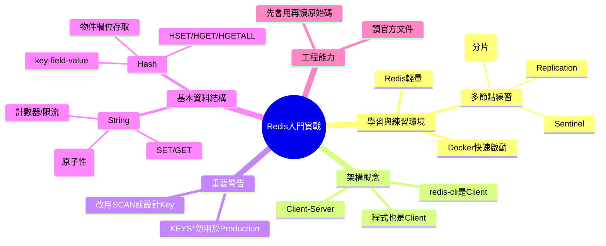

# 📌 本節主題總覽（3~5句摘要）

本節用「教學練習」的角度說明：Redis 很輕量，適合在小規格機器或本機用 Docker 一次啟多個節點來練習 replication / sentinel / cluster 等分散式能力。接著釐清 Redis 的 client-server 形態：Redis 是伺服器，你的程式（或 redis-cli）是 client。課程示範了 Redis 的基本資料結構與指令：String（SET/GET/INCR）與 Hash（HSET/HGET/HGETALL），並強調 `INCR` 的**原子性**可避免競態條件。最後提醒：`KEYS *` 在正式環境很傷效能；以及「會用工具不是最難」，更重要的是能看官方文件、理解選型與取捨。

# 🧠 核心觀念拆解

## 1. Redis 輕量與學習價值（比起 MySQL 更好做實驗）

- 定義：Redis 以記憶體為主、啟動成本低，適合用來搭建多節點做分散式練習（cluster/sentinel/replication）。
- 為什麼重要（Why）：
    - 初學者需要「可負擔的實驗環境」練習分散式概念。
    - MySQL 在小機器上做 replication 可能資源吃緊（記憶體/IO），Redis 相對容易跑起來。
- 運作原理（How）：
    - Redis 本體進程較輕，常見可以在同一台機器或同一台 VM 上啟動多個 Redis instance 供練習。
- 範例：
    - 用 Docker 在本機啟動 Redis，快速得到可操作環境（不必安裝到 OS）。
- 常見錯誤：
    - 在超小規格機器上硬練資料庫 replication，結果把環境問題誤判成技術問題。
    - 一開始就追求看懂 cluster 細節，卻沒先熟悉基本指令與資料結構。

## 2. Redis 是 Client-Server 架構（redis-cli / 程式都是 Client）

- 定義：Redis 本身是一個伺服器（server）；你透過 redis-cli 或應用程式發指令連線它（client）。
- 為什麼重要（Why）：
    - 你要理解「連線、指令、回應」的模型，才能正確地把 Redis 接入 ASP.NET Core。
- 運作原理（How）：
    - Client 建立 TCP 連線 → 發送命令 → Redis 執行 → 回傳結果。
- 範例（ASP.NET Core MVC：程式扮演 client）
    - 在 Controller/Service 內用 Redis client（例如 StackExchange.Redis）操作 Redis。
- 常見錯誤：
    - 把 Redis 誤以為是「嵌入式函式庫」直接在程式內使用（其實多數情境是連到外部 Redis 服務）。

## 3. `KEYS *` 是危險指令（Production 別用）

- 定義：`KEYS pattern` 會掃描大量 key，資料量大時會阻塞 Redis，對效能影響非常大。
- 為什麼重要（Why）：
    - Redis 常在關鍵路徑（快取、限流、鎖、session），一旦被阻塞，整個系統會卡。
- 運作原理（How）：
    - `KEYS *` 需要遍歷 keyspace，會佔用 Redis 單執行緒事件迴圈時間。
- 範例：
    - 開發機查 key 可以；正式環境改用 `SCAN`（漸進式掃描）或設計 key 命名避免查全庫。
- 常見錯誤：
    - 在排錯時直接在 production 下 `KEYS *`，造成瞬間性能雪崩。

## 4. Redis String：`SET/GET` 與計數器 `INCR`（原子性）

- 定義：
    - **String** 是最基本的 key-value：value 通常是字串（也可存數字字串）。
    - `INCR key` 將數字加 1，並保證原子性（atomic）。
- 為什麼重要（Why）：
    - 計數器是實務常見需求：限流、點擊數、序號、簡易統計。
    - 原子性可避免多請求同時更新導致的競態（race condition）。
- 運作原理（How）：
    - Redis 對單一命令的執行是原子性的：多 client 同時 `INCR` 不會互相插隊造成錯誤。
- 範例（ASP.NET Core MVC：用 `INCR` 做每分鐘請求計數）

```csharp
using Microsoft.AspNetCore.Mvc;
using StackExchange.Redis;

public class CounterController : Controller
{
    private readonly IDatabase _db;
    public CounterController(IConnectionMultiplexer mux) => _db = mux.GetDatabase();

    [HttpPost("/api/counter/incr")]
    public async Task<IActionResult> Incr()
    {
        var key = $"req:{DateTime.UtcNow:yyyyMMddHHmm}";
        var value = await _db.StringIncrementAsync(key); // INCR 原子性
        await _db.KeyExpireAsync(key, TimeSpan.FromMinutes(2));
        return Ok(new { key, value });
    }
}
```

- 常見錯誤：
    - 在程式端先 `GET` 再 `SET` 自己加 1（非原子），高併發下會算錯。
    - 忘記設定過期，計數 key 永遠累積造成記憶體壓力。

## 5. Redis Hash：`HSET/HGET/HGETALL`（適合存「物件欄位」）

- 定義：Hash 是「key →（field → value）」的結構，適合存一個物件的多個欄位，例如 user 的 name、role。
- 為什麼重要（Why）：
    - 比起把整個物件序列化成 JSON 字串再存 String，Hash 允許你只更新/讀取某個欄位，資料結構更貼近「物件」。
- 運作原理（How）：
    - 同一個 Redis key 下，維護多個 field；你可取單欄位（HGET）或整包（HGETALL）。
- 範例（ASP.NET Core MVC：存使用者基本資料）

```csharp
using Microsoft.AspNetCore.Mvc;
using StackExchange.Redis;

public class UserHashController : Controller
{
    private readonly IDatabase _db;
    public UserHashController(IConnectionMultiplexer mux) => _db = mux.GetDatabase();

    [HttpPost("/users/{id}/profile")]
    public async Task<IActionResult> SaveProfile(int id, string name, string role)
    {
        var key = $"user:{id}";
        await _db.HashSetAsync(key, new HashEntry[]
        {
            new("name", name),
            new("role", role)
        });

        return Ok();
    }

    [HttpGet("/users/{id}/profile")]
    public async Task<IActionResult> GetProfile(int id)
    {
        var key = $"user:{id}";
        var entries = await _db.HashGetAllAsync(key);

        var dict = entries.ToDictionary(x => x.Name.ToString(), x => x.Value.ToString());
        return Ok(dict);
    }
}
```

- 常見錯誤：
    - Hash 的「key/field」命名混亂（例如把 `user:1:name` 當 key 存 String，導致 key 爆量且難管理）。
    - 把 JSON 存 String 後又頻繁做局部欄位查詢（每次都要整包反序列化）。

## 6. 「先會用，再看原始碼」與官方文件能力

- 定義：先用 Redis 解決實際問題（快取、計數、限流、佇列），再去讀原始碼與內部設計，學習會更有效率。
- 為什麼重要（Why）：
    - 工程師日常就是閱讀文件與選型；「操作工具」本身通常不是最難的部分。
- 運作原理（How）：
    - 先建立問題感（為何要 INCR？為何不用 KEYS？）→ 再理解底層為何能高效。
- 範例：
    - 先做出一個簡單 rate limiter（用 INCR + TTL）→ 再去看 Redis 事件迴圈與資料結構如何支撐吞吐。
- 常見錯誤：
    - 把學習重心全部放在「抄指令」，但不理解使用情境與風險邊界。

# 🗺 知識結構圖（Mermaid mindmap）



# 🏗 抽象層級分析

- 這個觀念屬於哪個 abstraction layer？
    - **工具/基礎設施層**（Redis server、Docker）、**應用層**（計數器、物件存取）、**分散式系統層**（replication/sentinel/cluster）、**可靠性與效能層**（避免 KEYS 阻塞、原子操作）。
- 它解決的是哪一種 engineering problem？
    - **低延遲共享狀態**、**高併發計數/限流**、**快取/Session/鎖**、以及「用小成本練習分散式」的學習問題。
- 有沒有替代方案？
    - 單機快取：`IMemoryCache`。
    - 計數器：資料庫（不建議高頻）、或使用 API Gateway/WAF 內建限流。
    - 可靠隊列：Kafka/RabbitMQ（比 Redis list/pubsub 更適合做可靠訊息）。
- 它的 trade-off 是什麼？
    - **Redis 很快**但需要維運與監控；使用不當（KEYS、無 TTL）會拖垮整體。
    - **Hash 易做欄位更新**但欄位設計要有規範；JSON String 方式簡單但每次都要序列化/反序列化。
    - **先回成功的學習很快**，但要區分哪些資料能最終一致、哪些必須強一致。

# ⚠ 設計上的陷阱與邊界條件

- `KEYS *` 在 production 會造成阻塞，等同自我 DDoS。
- 計數器若不用原子操作（GET+SET），高併發下必定出錯。
- Hash 與 JSON String 的選擇要看「是否需要部分欄位更新/查詢」。
- Redis 雖輕量，但多節點（cluster/sentinel）仍有網路與故障情境，練習時要刻意模擬斷線/重啟。
- Key 沒 TTL 會造成記憶體無限制成長；TTL 太短又會造成命中率下降與回源壓力。

# 📘 可加入知識庫的標準定義版本

## 1. Beginner 必須理解

- Redis 是一個獨立的 server，你透過 client（程式或 redis-cli）操作它。
- 最基本資料結構是 String（SET/GET），`INCR` 可做安全的計數器。
- `KEYS *` 在正式環境很危險，避免使用。

## 2. Intermediate 必須掌握

- Hash 的 key-field-value 模型，適合存使用者/設定檔等「物件欄位」。
- 能在 ASP.NET Core 中用 Redis client 串接（連線、讀寫、TTL）。
- 理解為什麼原子操作能避免 race condition，以及 TTL 對資源管理的重要性。

## 3. Advanced 才需要深入

- replication/sentinel/cluster 的角色與故障轉移、分片概念。
- 效能與可用性調校：避免阻塞指令、熱點 key、容量規劃與監控。
- 進一步閱讀原始碼理解高效能設計（事件迴圈、資料結構實作）。

**不同層級差異**：  
Beginner 會用基本指令與知道禁忌；Intermediate 能在專案中正確建模與串接；Advanced 才進入高可用架構與底層效能原理。

# 🔗 與其他技術的關聯

- 與資料結構的關聯：
    - String/Hash/List/Set/Sorted Set 對應基礎資料結構；Hash 對應「物件欄位字典」；INCR 對應原子計數器。
- 與作業系統的關聯：
    - 記憶體速度與揮發性、網路連線；阻塞操作（KEYS）會佔用服務處理時間。
- 與設計模式的關聯：
    - Cache-Aside（快取）、Counter（計數器���、Producer-Consumer（佇列）、Idempotency（用計數/狀態避免重複）。
- 與實務開發的關聯：
    - ASP.NET Core 常用 StackExchange.Redis；也常用 Redis 做分散式快取、session、限流與鎖。

# 🚀 實務應用場景

- **Scenario：產線看板的即時計數與限流**
    
    - 角色：產線主管（頻繁刷新看板）、IT 管理員（要防止外部或內部刷爆）
    - 商業需求：看板要快、DB 不能被打爆；異常流量要能快速擋下
    - 操作流程：請求先透過 Redis `INCR` 計數（每 IP/每使用者/每 API key），超過門檻回 429；同時看板資料用 Redis 快取短 TTL
    - 預期資料：
        - `rl:{userId}:{yyyyMMddHHmmss}` → count（TTL 2 秒）
        - `kpi:line:{lineId}` → 聚合 JSON（TTL 5~15 秒）
- **Scenario：後台使用者設定檔（Hash 儲存）**
    
    - 角色：IE 工程師、排程人員
    - 商業需求：快速讀取偏好設定/權限資訊，減少每次都查 DB
    - 操作流程：登入後先讀 `user:{id}` Hash（name/role/plant），缺少再回源 DB，並寫回 Redis
    - 預期資料：`user:{id}` 的 fields：`name`、`role`、`plant`