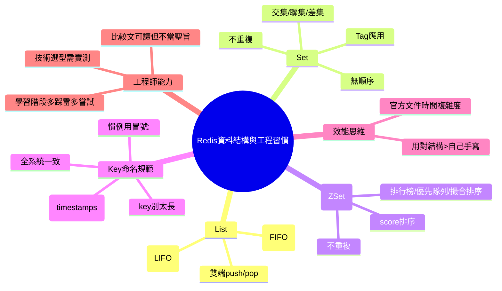

# 📌 本節主題總覽（3~5句摘要）

本節用初學者熟悉的「Queue / Stack」切入，說明 Redis 的 **List** 透過「從哪邊放、從哪邊拿」即可扮演不同抽象資料型別。接著介紹 **Set**（不重複、無順序）與 **Sorted Set**（不重複且可排序），並以標籤（tag）交集、交易所撮合/排行榜等案例說明其價值：很多時候讓 Redis 的資料結構幫你做，比自己寫更穩、更快。然後談到工程實務的「Key 命名規範」：常用 `:` 分隔、保持一致、key 不要太長、避免把不可預期的動態��當 key。最後提醒：看性能比較文章要謹慎；真正的技術選型要基於你的情境測試與官方文件，並訓練自己具備獨立查證與評估能力。

# 🧠 核心觀念拆解

## 1. List 的雙端操作：同一結構可做 Queue 或 Stack

- 定義：Redis 的 List 是可從「頭/尾」兩端 push/pop 的序列結構；透過操作方向可模擬 Queue（FIFO）或 Stack（LIFO）。
- 為什麼重要（Why）：
    - 初學者常在演算法題遇到 Queue/Stack；Redis List 讓你把抽象概念落地成可用的系統元件（例如任務佇列、工作排程）。
- 運作原理（How）：
    - Queue（FIFO）：尾端放入、頭端取出（或相反，只要遵守「先進先出」）。
    - Stack（LIFO）：同一端放入、同一端取出（後進先出）。
- 範例（ASP.NET Core MVC：用 List 當簡易 Queue，示意）

```csharp

using Microsoft.AspNetCore.Mvc;
using StackExchange.Redis;

public class RedisListQueueController : Controller
{
    private readonly IDatabase _db;
    public RedisListQueueController(IConnectionMultiplexer mux) => _db = mux.GetDatabase();

    // 入隊：從右邊塞 (RPUSH)
    [HttpPost("/jobs/enqueue")]
    public async Task<IActionResult> Enqueue(string payload)
    {
        await _db.ListRightPushAsync("jobs:queue", payload);
        return Ok();
    }

    // 出隊：從左邊拿 (LPOP) => FIFO
    [HttpPost("/jobs/dequeue")]
    public async Task<IActionResult> Dequeue()
    {
        var item = await _db.ListLeftPopAsync("jobs:queue");
        return Ok(new { item = item.ToString() });
    }
}

```


- 常見錯誤：
    - 沒先定義「放哪邊、拿哪邊」，同團隊各寫各的，導致順序混亂。
    - 把 Redis List 當成「完全可靠」的訊息佇列（大量任務、必達需求通常要專用 MQ）。

## 2. Queue vs Stack：FIFO / LIFO 的行為差異

- 定義：
    - Queue：先進先出（FIFO）。
    - Stack：後進先出（LIFO）。
- 為什麼重要（Why）：
    - 同樣是「排隊」，但行為差異會直接影響業務邏輯，例如工單處理是否依時間順序、或是否需要「最後一次操作優先」。
- 運作原理（How）：
    - FIFO 適合：任務處理、排程、批次作業。
    - LIFO 適合：瀏覽器上一頁、遞迴回溯、Undo/Redo。
- 範例（成衣廠）：
    - FIFO：掃描上報任務按時間排隊寫入。
    - LIFO：後台操作「撤銷上一個設定變更」（類 Undo）。
- 常見錯誤：
    - 用錯資料結構造成「處理順序不符合期待」，最後用很多 if/else 補救。

## 3. Set：不重複、無順序 + 集合運算（交集/聯集/差集）

- 定義：Set 是「不允許重複」且「不保證順序」的集合；Redis 也支援集合運算。
- 為什麼重要（Why）：
    - 去重（dedup）與集合運算在推薦、標籤、權限、名單、活動名單都很常見。
- 運作原理（How）：
    - 重複元素寫入會被自動忽略（去重由系統幫你做）。
    - 可對多個 set 做交集/聯集/差集，快速得出結果。
- 範例（成衣廠）：
    - `user:1:tags` 與 `user:2:tags` 的交集：找兩位採購/IE 共同關注的布料/工序標籤。
- 常見錯誤：
    - 需要排序卻用 Set（Set 沒順序）；最後又在應用層自己排序，浪費。

## 4. Sorted Set：不重複 + 可排序（score）

- 定義：Sorted Set（ZSet）是「不重複」的集合，每個元素有一個 score，Redis 會依 score 排序。
- 為什麼重要（Why）：
    - 適合排行榜、優先隊列、撮合排序、延遲任務等需要「排序 + 去重」的情境。
- 運作原理（How）：
    - element 唯一；score 決定排序。
    - 你可以用 score 表示「價格、時間戳、權重」等。
- 範例（撮合/排行榜類比到成衣廠）：
    - 排程優先度：用 score = 交期風險分數，快速取出最需要先處理的工單。
- 常見錯誤：
    - 把複雜排序邏輯硬寫在 DB 查詢或應用層，卻忽略 ZSet 已可高效處理（但仍要評估一致性與資料來源）。

## 5. Key 命名規範：用 `:` 分隔、保持一致、避免過長與動態 key

- 定義：Redis key 的命名是一種工程慣例（非強制語法），常見格式如 `entity:{id}:subkey`，例如 `user:123:profile`。
- 為什麼重要（Why）：
    - 良好的命名讓你可維護、可讀、可操作（刪除/失效/監控）；
    - 命名混亂會讓快取失效、清理與排查變得非常痛苦。
- 運作原理（How）：
    - 使用 `:` 做層級分隔是社群常見約定，方便人眼閱讀與管理。
    - Key 不宜過長：浪費記憶體、操作與掃描成本更高。
    - 避免把不可預期的動態資料（例如 timestamp）直接當 key，否則會「找不回來」或造成 key 爆炸。
- 範例：
    - 好：`workorder:WO123:detail`
    - 風險：`workorder:WO123:detail:20260220123059`（帶時間戳，幾乎等於每次都新 key）
- 常見錯誤：
    - 同系統同概念，有的用 `-`、有的用 `:`、有的用 `_`，造成一致性崩壞。
    - Key 設計沒有考慮後續「失效/刪除」需要刪哪一群 key。

## 6. 參考時間複雜度：用對資料結構比「自己寫」更有效

- 定義：Redis 官方文件會標示指令的時間複雜度（Big-O），可用於選擇適合的資料結構與操作。
- 為什麼重要（Why）：
    - 同樣結果可能有多種做法；你希望選擇更符合效能需求的那一種。
- 運作原理（How）：
    - 先定需求（是否要排序？是否要去重？是否要範圍查詢？）
    - 再選資料結構（List/Set/ZSet/Hash/String）
    - 用官方文件的複雜度評估在資料量放大後是否可行
- 範例：
    - 排行榜：ZSet 天生適配；你自己在應用層維護排序，通常更難寫對也更難快。
- 常見錯誤：
    - 只看網路比較文就下結論，不看「在比什麼」與「是否符合你的資料量與存取模式」。

## 7. 技術選型與自學能力：官方文件 + 情境測試

- 定義：工程師需能基於需求、指標與限制做選型；學習階段要練習自己查官方文件與實測比較。
- 為什麼重要（Why）：
    - 工具、框架、語言各有擅長面向；照單全收比較文容易誤判。
- 運作原理（How）：
    - 先定成功指標（延遲、吞吐、成本、可靠性）
    - 在你的情境下做 PoC/壓測/故障演練
- 範例（ASP.NET Core MVC 專案）：
    - 你要做任務處理：先用 Redis List 做 PoC，再評估是否需要升級到 RabbitMQ/Kafka。
- 常見錯誤：
    - 把比較文章當聖旨，不做自己情境的測試。
    - 永遠等別人告訴你用哪個套件，而不自己試用與評估。

# 🗺 知識結構圖（Mermaid mindmap）




# 🏗 抽象層級分析

- 這個觀念屬於哪個 abstraction layer？
    - **資料結構層**（Queue/Stack/Set/ZSet）、**應用架構層**（用 Redis 當 Q/排行榜/去重）、**工程方法論層**（命名規範、選型與實測）、以及 **效能層**（時間複雜度與操作成本）。
- 它解決的是哪一種 engineering problem？
    - **共享狀態的高效存取**、**任務排隊/去重/排序**、**可維護性（命名一致）**、**效能可預期性（Big-O）**。
- 有沒有替代方案？
    - Queue：RabbitMQ/Kafka/SQS（更可靠）、或資料庫佇列（不建議高頻）。
    - 去重/集合運算：關聯式 DB（JOIN/Distinct）或 Elasticsearch（依情境）。
    - 排序：DB ORDER BY（資料量大時成本高）、專用搜尋/排名系統。
- 它的 trade-off 是什麼？
    - Redis 很快但資料在記憶體、容量有限且需要維運���
    - 用 Redis 資料結構很省開發時間，但需要設計 key、TTL、一致性與清理策略。
    - ZSet 很強但若濫用（大量元素、頻繁更新 score）也會帶來成本，需要壓測驗證。

# ⚠ 設計上的陷阱與邊界條件

- 用 List 當 Queue 時，若沒有消費者或失敗重試策略，容易積壓與記憶體膨脹。
- Set 只能去重不能排序；需要排序請選 ZSet 或另行設計。
- Key 命名不一致會直接影響：快取失效、資料清理、監控告警與團隊協作。
- Key 過長或 key 爆炸（例如 timestamp 當 key）會造成記憶體浪費與管理困難。
- 比較文沒有意義除非你的「資料量、存取模式、硬體、網路」相近；否則結論不可直接照抄。

# 📘 可加入知識庫的標準定義版本

## 1. Beginner 必須理解

- Redis 的 List 可以透過「從哪邊放/拿」變成 Queue（FIFO）或 Stack（LIFO）。
- Set 是「不重複、無順序」，適合 tag 去重與集合運算。
- Sorted Set（ZSet）是「不重複 + 可排序」，適合排行榜與優先排序需求。
- Redis key 命名要一致，常用 `:` 分隔；避免動態 key 與過長 key。

## 2. Intermediate 必須掌握

- 能根據需求選結構：要 FIFO→List；要去重→Set；要排序→ZSet；要物件欄位→Hash（前一節）。
- 會設計 key 規範（namespace、id、子資源），並能規劃後續失效/刪除策略。
- 會查官方文件的時間複雜度，並做簡單壓測驗證。

## 3. Advanced 才需要深入

- 在高併發與大資料量下評估 Redis 結構操作成本、熱點 key、分片策略與記憶體模型。
- 對「把 Redis 當 Queue」的可靠性補強（重試、死信、ACK、Exactly-once 需求通常要 MQ）。
- 建立團隊級最佳實務（命名、監控、容量預估、災難復原演練）。

**不同層級差異**：  
Beginner 先會用結構與理解行為；Intermediate 會做正確選型與命名規範；Advanced 針對規模化、可靠性與維運做系統性設計。

# 🔗 與其他技術的關聯

- 與資料結構的關聯：
    - Queue/Stack（FIFO/LIFO）、Set（集合運算）、Priority/Ranking（ZSet + score）、以及時間複雜度（Big-O）。
- 與作業系統的關聯：
    - 記憶體限制、網路延遲；大量 key 會增加記憶體壓力；阻塞/掃描操作會影響整體吞吐。
- 與設計模式的關聯：
    - Producer-Consumer（佇列）、Cache-Aside（快取）、Idempotency（去重）、Priority Queue（ZSet）。
- 與實務開發的關聯：
    - ASP.NET Core MVC 常用 Redis 做：背景任務排隊、tag 去重、排行榜、限流、分散式鎖；並需要一致的 key naming convention。

# 🚀 實務應用場景

- **Scenario：產線任務佇列（List 做 Queue）**
    
    - 角色：產線掃描設備、後端任務處理服務
    - 商業需求：掃描事件高頻進來，不能每次都同步寫 DB 造成卡頓
    - 操作流程：設備上報→API 將事件 `RPUSH jobs:queue` → 背景 worker `LPOP` 處理並落庫
    - 預期資料：`jobs:queue` 裡存 JSON payload（需搭配 TTL/監控/重試策略）
- **Scenario：工單標籤與交集查詢（Set）**
    
    - 角色：IE 工程師、計劃人員
    - 商業需求：快速找「同時符合 A/B 標籤」的工單或款式
    - 操作流程：工單打標籤→加入 set；查詢時用交集運算得到候選集合
    - 預期資料：`workorder:WO123:tags`、`tag:needleBreak:workorders`
- **Scenario���優先處理清單（Sorted Set）**
    
    - 角色：生管/排程
    - 商業需求：依交期風險或客戶等級排序，快速取出前 N 筆最優先工單
    - 操作流程：更新風險分數→更新 ZSet score；取出 top N→派工
    - 預期資料：`schedule:priority`（member=工單號，score=風險分數或��間）