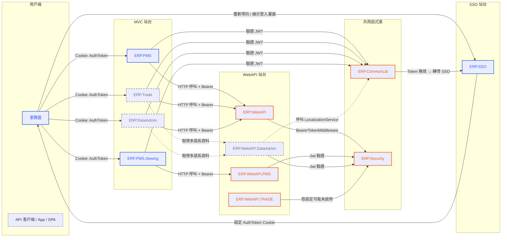
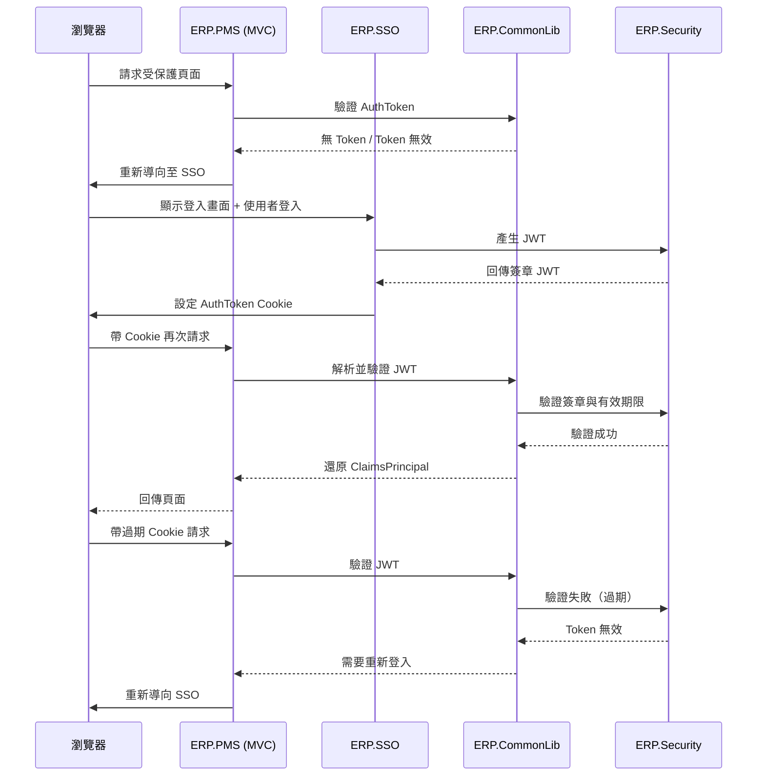

# System Interaction Map

本文件聚焦在「執行期（runtime）交互關係」：各站台如何透過 redirect / cookie / bearer token / API 呼叫來完成登入、驗證、授權、以及（部分）多語資料查詢。

> 圖中同時混合了兩種關係：
> 1) **執行期呼叫**（HTTP / redirect / cookie）
> 2) **共用程式庫能力**（ERP.Security / ERP.CommonLib 提供 middleware / token 工具）

---

## Runtime 交互依賴圖（Mermaid / mmd）

✅ 架構圖加入顏色區分

- 藍色：使用者流程（Browser / 外部呼叫）
- 橘色：系統內部流程（Server ↔ Server）
- 灰色：靜態依賴

# 團隊閱讀重點

藍色線 = 使用者主動行為  
橘色線 = 系統自動處理  
灰色虛線 = 內部服務依賴

這樣一眼就能看出：
- Cookie 只存在於使用者流程
- Bearer 只存在於 Server-to-Server
- Security 只在 API 層生效

---

## 圖的閱讀提示
- MVC 站台的「身份還原」主要靠 CommonLib 的 `UseJwtAuthentication()`：從 cookie `AuthToken` 還原 `HttpContext.User`；失敗就 redirect 到 SSO。
- WebAPI 站台的「token gate」主要靠 Security 的 `BearerTokenMiddleware`（前置檢查）與 JwtBearer/TokenGenerator（簽發/驗證）。
- SSO 是瀏覽器登入體驗與 CookieAuthentication ticket 的落點；但多數 MVC 站台實務上仍大量仰賴 `AuthToken`（JWT）作為跨站身份材料。
- Localization 的 DB 治理能力在 CommonLib，對外 API 入口可見於 WebAPI.DataAdmin（供 UI/模組查字典用）。

---
## 二、JWT + Cookie + SSO 完整時序圖

這張圖用來解釋：

- 首次登入
- Cookie 建立
- JWT 驗證
- Token 過期流程

### 備註：

> Cookie 是傳輸機制  
> JWT 是身份憑證  
> Security 是信任根  
> CommonLib 是驗證入口