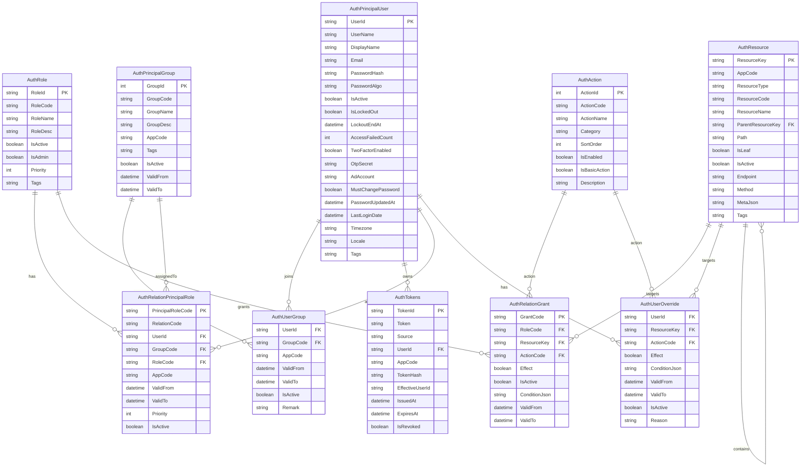

```mermaid
erDiagram
    AuthPrincipalUser {
        string UserId PK
        string UserName
        string DisplayName
        string Email
        string PasswordHash
        string PasswordAlgo
        boolean IsActive
        boolean IsLockedOut
        datetime LockoutEndAt
        int AccessFailedCount
        boolean TwoFactorEnabled
        string OtpSecret
        string AdAccount
        boolean MustChangePassword
        datetime PasswordUpdatedAt
        datetime LastLoginDate
        string Timezone
        string Locale
        string Tags
    }
    AuthPrincipalGroup {
        int GroupId PK
        string GroupCode
        string GroupName
        string GroupDesc
        string AppCode
        string Tags
        boolean IsActive
        datetime ValidFrom
        datetime ValidTo
    }
    AuthRole {
        string RoleId PK
        string RoleCode
        string RoleName
        string RoleDesc
        boolean IsActive
        boolean IsAdmin
        int Priority
        string Tags
    }
    AuthResource {
        string ResourceKey PK
        string AppCode
        string ResourceType
        string ResourceCode
        string ResourceName
        string ParentResourceKey FK
        string Path
        boolean IsLeaf
        boolean IsActive
        string Endpoint
        string Method
        string MetaJson
        string Tags
    }
    AuthAction {
        int ActionId PK
        string ActionCode
        string ActionName
        string Category
        int SortOrder
        boolean IsEnabled
        boolean IsBasicAction
        string Description
    }
    AuthRelationPrincipalRole {
        string PrincipalRoleCode PK
        string RelationCode
        string UserId FK
        string GroupCode FK
        string RoleCode FK
        string AppCode
        datetime ValidFrom
        datetime ValidTo
        int Priority
        boolean IsActive
    }
    AuthRelationGrant {
        string GrantCode PK
        string RoleCode FK
        string ResourceKey FK
        string ActionCode FK
        boolean Effect
        boolean IsActive
        string ConditionJson
        datetime ValidFrom
        datetime ValidTo
    }
    AuthUserOverride {
        string UserId FK
        string ResourceKey FK
        string ActionCode FK
        boolean Effect
        string ConditionJson
        datetime ValidFrom
        datetime ValidTo
        boolean IsActive
        string Reason
    }
    AuthUserGroup {
        string UserId FK
        string GroupCode FK
        string AppCode
        datetime ValidFrom
        datetime ValidTo
        boolean IsActive
        string Remark
    }
    AuthTokens {
        string TokenId PK
        string Token
        string Source
        string UserId FK
        string AppCode
        string TokenHash
        string EffectiveUserId
        datetime IssuedAt
        datetime ExpiresAt
        boolean IsRevoked
    }
    AuthPrincipalUser ||--o{ AuthUserGroup : joins
    AuthPrincipalGroup ||--o{ AuthUserGroup : contains
    AuthPrincipalUser ||--o{ AuthTokens : owns

    AuthPrincipalUser ||--o{ AuthRelationPrincipalRole : assignedTo
    AuthPrincipalGroup ||--o{ AuthRelationPrincipalRole : assignedTo
    AuthRole ||--o{ AuthRelationPrincipalRole : has

    AuthRole ||--o{ AuthRelationGrant : grants
    AuthResource ||--o{ AuthRelationGrant : targets
    AuthAction ||--o{ AuthRelationGrant : action

    AuthPrincipalUser ||--o{ AuthUserOverride : has
    AuthResource ||--o{ AuthUserOverride : targets
    AuthAction ||--o{ AuthUserOverride : action

    AuthResource ||--o{ AuthResource : contains
```
